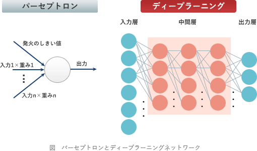

# [平成30年春期 午前 問1](https://www.ap-siken.com/kakomon/30_haru/q1.html)

#問題 #テクノロジ #基礎理論 #情報に関する理論

解説を表示解説を隠す

<strong>問1</strong>　AIにおけるディープラーニングに最も関連が深いものはどれか。

<ul class="ap-choices">
<li class="ap-choice-item ap-wrong">

ア　試行錯誤しながら条件を満たす解に到達する方法であり，場合分けを行い深さ優先で探索し，解が見つからなければ一つ前の場合分けの状態に後戻りする。

これは<a href="用語/木構造" class="internal-link" data-href="用語/木構造">木構造</a>やグラフ構造に対する<a href="用語/深さ優先探索" class="internal-link" data-href="用語/深さ優先探索">深さ優先探索</a>に関する記述です。

</li>
<li class="ap-choice-item ap-correct">

イ　神経回路網を模倣した方法であり，多層に配置された素子とそれらを結ぶ信号線で構成され，信号線に付随するパラメータを調整することによって入力に対して適切な解が出力される。

正しい。<a href="用語/ディープラーニング" class="internal-link" data-href="用語/ディープラーニング">ディープラーニング</a>に関する記述です。

</li>
<li class="ap-choice-item ap-wrong">

ウ　生物の進化を模倣した方法であり，与えられた問題の解の候補を記号列で表現して，それを遺伝子に見立てて突然変異，交配，とう汰を繰り返して逐次的により良い解に近づける。

これはコンピュータの制御に偶発的な要素を取り入れる遺伝的アルゴリズムに関する記述です。

</li>
<li class="ap-choice-item ap-wrong">

エ　物質の結晶ができる物理現象を模倣した方法であり，温度に見立てたパラメータを制御して，大ざっぱな解の候補から厳密な解の候補に変化させる。

焼きなまし法に関する記述です。

</li>
</ul>

<h4>解説</h4>

<a href="用語/ディープラーニング" class="internal-link" data-href="用語/ディープラーニング">ディープラーニング</a>(Deep Learning)は、人間や動物の脳神経をモデル化したアルゴリズム(<a href="用語/ニューラルネットワーク" class="internal-link" data-href="用語/ニューラルネットワーク">ニューラルネットワーク</a>)を多層化したものを用意し、それに「十分な量のデータを与えることで、人間の力なしに自動的に特徴点やパターンを学習させる」ことをいいます。

<a href="用語/ディープラーニング" class="internal-link" data-href="用語/ディープラーニング">ディープラーニング</a>では、脳の神経細胞であるニューロンの信号伝達をパーセプトロンというアルゴリズムで模倣し、それを大量かつ幾層にもに繋ぎ合わせた疑似的な脳神経網ネットワークを使用して学習を行います。

このネットワークに大量の学習用データ（入力値と正しい解の組み）を与え、損失関数や勾配法、誤差逆伝播法などの数学的なアプローチを用いて、出力と正しい解の差異が最小になるように中間層のパラメータ（重みと<a href="用語/しきい値" class="internal-link" data-href="用語/しきい値">しきい値</a>）を自動調整していきます。この仕組みにより、入力に対して最適解を出力するシステム（学習モデル）を得るのが<a href="用語/ディープラーニング" class="internal-link" data-href="用語/ディープラーニング">ディープラーニング</a>です。学習させるデータが多いほど判定の精度も高まっていきます。

