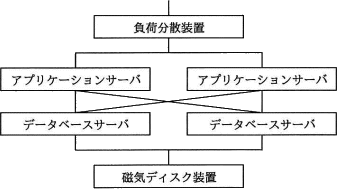
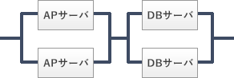
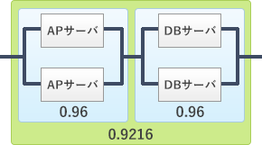

# [平成30年春期 午前 問16](https://www.ap-siken.com/kakomon/30_haru/q16.html)

#問題 #テクノロジ #システム構成要素 #システムの評価指標

解説を表示解説を隠す

<strong>問16</strong>　4種類の装置で構成される次のシステムの稼働率は，およそ幾らか。ここで，アプリケーションサーバとデータベースサーバの稼働率は0.8であり，それぞれのサーバのどちらかが稼働していればシステムとして稼働する。また，負荷分散装置と磁気ディスク装置は，故障しないものとする。 

<ul class="ap-choices">
<li class="ap-choice-item ap-wrong">

ア　0.64

サーバ単体を直列接続とみなして 0.8×0.8 とした値です。

</li>
<li class="ap-choice-item ap-wrong">

イ　0.77

本問の並列・直列の組合せでは得られない値です。

</li>
<li class="ap-choice-item ap-correct">

ウ　0.92

正しい。各サーバ群の並列<a href="用語/稼働率" class="internal-link" data-href="用語/稼働率">稼働率</a> 0.96 を直列で掛け合わせた値です。

</li>
<li class="ap-choice-item ap-wrong">

エ　0.96

サーバ群1組の並列<a href="用語/稼働率" class="internal-link" data-href="用語/稼働率">稼働率</a>のみで止めた値です。

</li>
</ul>

<h4>解説</h4>

4種類の装置のうち、負荷分散装置と磁気ディスク装置は故障しないので、システム全体の<a href="用語/稼働率" class="internal-link" data-href="用語/稼働率">稼働率</a>はアプリケーションサーバ（以下、APサーバ）とデータベースサーバ（以下、DBサーバ）の部分だけによって決まります。そしてAPサーバとDBサーバは、2台のうちどちらかが稼働していればよいため、下図のように2台が並列に接続されているものと見なせます。

装置単体の<a href="用語/稼働率" class="internal-link" data-href="用語/稼働率">稼働率</a>がRのとき、2台が並列に接続されている場合の全体としての<a href="用語/稼働率" class="internal-link" data-href="用語/稼働率">稼働率</a>は「1－(1－R)2」、直列の場合は「R2」で求められます。この公式を使って、まずは並列で接続されている部分の<a href="用語/稼働率" class="internal-link" data-href="用語/稼働率">稼働率</a>を計算します。

1－(1－0.8)2＝1－0.04＝0.96

APサーバ群、DBサーバ群の<a href="用語/稼働率" class="internal-link" data-href="用語/稼働率">稼働率</a>はともに0.96とわかります。そして<a href="用語/稼働率" class="internal-link" data-href="用語/稼働率">稼働率</a>0.96のサーバ群同士が直列で接続されているので、システム全体としての<a href="用語/稼働率" class="internal-link" data-href="用語/稼働率">稼働率</a>は、

0.96×0.96＝0.9216≒0.92

したがって「ウ」が正解です。

