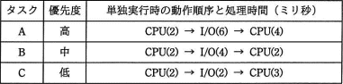
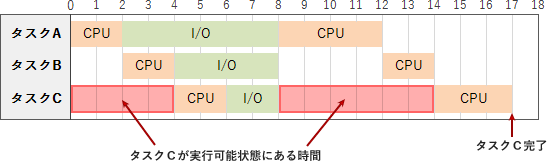

# [平成30年春期 午前 問17](https://www.ap-siken.com/kakomon/30_haru/q17.html)

#問題 #テクノロジ #ソフトウェア #オペレーティングシステム

解説を表示解説を隠す

<strong>問17</strong>　三つのタスクA～Cの優先度と各タスクを単独で実行した場合のCPUと入出力(I/O)装置の動作順序と処理時間は，表のとおりである。優先順位方式のタスクスケジューリングを行うOSの下で，三つのタスクが同時に実行可能状態になってから，タスクCが終了するまでに，タスクCが実行可能状態にある時間は延べ何ミリ秒か。ここで，I/Oは競合せず，OSのオーバーヘッドは考慮しないものとする。また，表中の()内の数字は処理時間を示すものとする。 

<ul class="ap-choices">
<li class="ap-choice-item ap-wrong">

ア　6

8～14ミリ秒の区間だけを数えた値であり，0～4ミリ秒の待ちを含めていない。

</li>
<li class="ap-choice-item ap-wrong">

イ　8

実行可能状態の延べ時間としては足りない。0～4と8～14を合わせると10ミリ秒になる。

</li>
<li class="ap-choice-item ap-correct">

ウ　10

正しい。0～4ミリ秒と8～14ミリ秒を合わせた10ミリ秒が<a href="用語/タスク" class="internal-link" data-href="用語/タスク">タスク</a>Cの実行可能状態の延べ時間である。

</li>
<li class="ap-choice-item ap-wrong">

エ　12

実行可能状態以外の時間も含めた過大な値である。正解は0～4と8～14の合計10ミリ秒。

</li>
</ul>

<h4>解説</h4>

優先順位方式は、実行可能状態にある<a href="用語/タスク" class="internal-link" data-href="用語/タスク">タスク</a>の中から最も<a href="用語/優先度" class="internal-link" data-href="用語/優先度">優先度</a>の高い<a href="用語/タスク" class="internal-link" data-href="用語/タスク">タスク</a>を実行していく方式です。開始時点からすべての<a href="用語/タスク" class="internal-link" data-href="用語/タスク">タスク</a>が完了するまでの経過は下図のようになります。

①<a href="用語/CPU" class="internal-link" data-href="用語/CPU">CPU</a>は最も<a href="用語/優先度" class="internal-link" data-href="用語/優先度">優先度</a>の高い<a href="用語/タスク" class="internal-link" data-href="用語/タスク">タスク</a>Aの処理を開始する。他2つの<a href="用語/タスク" class="internal-link" data-href="用語/タスク">タスク</a>は実行可能状態のまま待機する。

②2ミリ秒後に<a href="用語/タスク" class="internal-link" data-href="用語/タスク">タスク</a>Aの<a href="用語/CPU" class="internal-link" data-href="用語/CPU">CPU</a>処理が完了し、<a href="用語/タスク" class="internal-link" data-href="用語/タスク">タスク</a>AはI/Oに移る。残る2つの<a href="用語/タスク" class="internal-link" data-href="用語/タスク">タスク</a>の<a href="用語/優先度" class="internal-link" data-href="用語/優先度">優先度</a>は「<a href="用語/タスク" class="internal-link" data-href="用語/タスク">タスク</a>B＞<a href="用語/タスク" class="internal-link" data-href="用語/タスク">タスク</a>C」なので、<a href="用語/CPU" class="internal-link" data-href="用語/CPU">CPU</a>は<a href="用語/タスク" class="internal-link" data-href="用語/タスク">タスク</a>Bの処理を開始する。

③4ミリ秒後に<a href="用語/タスク" class="internal-link" data-href="用語/タスク">タスク</a>Bの<a href="用語/CPU" class="internal-link" data-href="用語/CPU">CPU</a>処理が完了する。I/Oは競合しないので<a href="用語/タスク" class="internal-link" data-href="用語/タスク">タスク</a>BはI/Oに移る。<a href="用語/CPU" class="internal-link" data-href="用語/CPU">CPU</a>は残った<a href="用語/タスク" class="internal-link" data-href="用語/タスク">タスク</a>Cの処理を開始する。

④6ミリ秒後に<a href="用語/タスク" class="internal-link" data-href="用語/タスク">タスク</a>Cの<a href="用語/CPU" class="internal-link" data-href="用語/CPU">CPU</a>処理が完了する。<a href="用語/タスク" class="internal-link" data-href="用語/タスク">タスク</a>CはI/Oに移る。

⑤8ミリ秒後に全<a href="用語/タスク" class="internal-link" data-href="用語/タスク">タスク</a>のI/Oが完了する。<a href="用語/CPU" class="internal-link" data-href="用語/CPU">CPU</a>は最も<a href="用語/優先度" class="internal-link" data-href="用語/優先度">優先度</a>の高い<a href="用語/タスク" class="internal-link" data-href="用語/タスク">タスク</a>Aの処理を開始し、他2つの<a href="用語/タスク" class="internal-link" data-href="用語/タスク">タスク</a>は実行可能状態に移る。

⑥12ミリ秒後に<a href="用語/タスク" class="internal-link" data-href="用語/タスク">タスク</a>Aの全処理が完了する。残る2つの<a href="用語/タスク" class="internal-link" data-href="用語/タスク">タスク</a>の<a href="用語/優先度" class="internal-link" data-href="用語/優先度">優先度</a>は「<a href="用語/タスク" class="internal-link" data-href="用語/タスク">タスク</a>B＞<a href="用語/タスク" class="internal-link" data-href="用語/タスク">タスク</a>C」なので、<a href="用語/CPU" class="internal-link" data-href="用語/CPU">CPU</a>は<a href="用語/タスク" class="internal-link" data-href="用語/タスク">タスク</a>Bの処理を開始する。

⑦14ミリ秒後に<a href="用語/タスク" class="internal-link" data-href="用語/タスク">タスク</a>Bの全処理が完了する。<a href="用語/CPU" class="internal-link" data-href="用語/CPU">CPU</a>は残った<a href="用語/タスク" class="internal-link" data-href="用語/タスク">タスク</a>Cの処理を開始する。

⑧17ミリ秒後に<a href="用語/タスク" class="internal-link" data-href="用語/タスク">タスク</a>Cの全処理が完了し、全ての<a href="用語/タスク" class="internal-link" data-href="用語/タスク">タスク</a>の完了となる。

<a href="用語/タスク" class="internal-link" data-href="用語/タスク">タスク</a>Cが実行可能状態にある時間は、0～4ミリ秒までと8～14ミリ秒までを合わせた10ミリ秒間です。よって「ウ」が正解です。

