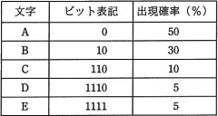

# [平成30年春期 午前 問2](https://www.ap-siken.com/kakomon/30_haru/q2.html)

#問題 #テクノロジ #基礎理論 #情報に関する理論

解説を表示解説を隠す

<strong>問2</strong>　表は，文字A～Eを符号化したときのビット表記と，それぞれの文字の出現確率を表したものである。1文字当たりの平均ビット数は幾らになるか。 

<ul class="ap-choices">
<li class="ap-choice-item ap-wrong">

ア　1.6

各文字のビット数×出現確率の総和は1.8であり、1.6にはならない。

</li>
<li class="ap-choice-item ap-correct">

イ　1.8

正しい。ビット数×出現確率の総和が1.8ビットになる。

</li>
<li class="ap-choice-item ap-wrong">

ウ　2.5

各文字のビット数×出現確率の総和は1.8であり、2.5にはならない。

</li>
<li class="ap-choice-item ap-wrong">

エ　2.8

各文字のビット数×出現確率の総和は1.8であり、2.8にはならない。

</li>
</ul>

<h4>解説</h4>

各文字を表すビット数とその出現確率をかけたものを足し合わせて平均ビット数を求めます。  A → 1ビット×0.5＝0.5ビット B → 2ビット×0.3＝0.6ビット C → 3ビット×0.1＝0.3ビット D → 4ビット×0.05＝0.2ビット E → 4ビット×0.05＝0.2ビット  すべてを足し合わせると、 0.5＋0.6＋0.3＋0.2＋0.2＝1.8ビット  したがって、平均ビット数は1.8ビットになります。  このように情報の出現確率が高いデータには短い符号を、低いデータには長い符号を与えることで圧縮を効率よく行う方法を<a href="用語/ハフマン符号" class="internal-link" data-href="用語/ハフマン符号">ハフマン符号</a>といいます。

