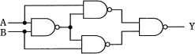
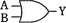
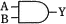
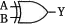
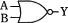
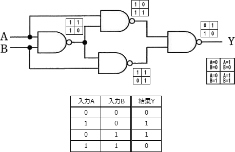

# [平成30年春期 午前 問21](https://www.ap-siken.com/kakomon/30_haru/q21.html)

#問題 #テクノロジ #ハードウェア #ハードウェア

解説を表示解説を隠す

<strong>問21</strong>　図の論理回路と等価な回路はどれか。 

<ul class="ap-choices">
<li class="ap-choice-item ap-wrong">

ア　

これは<a href="用語/論理和" class="internal-link" data-href="用語/論理和">論理和</a>の説明です

</li>
<li class="ap-choice-item ap-wrong">

イ　

これは<a href="用語/論理積" class="internal-link" data-href="用語/論理積">論理積</a>の説明です

</li>
<li class="ap-choice-item ap-correct">

ウ　

正しい。詳細：<a href="用語/排他的論理和" class="internal-link" data-href="用語/排他的論理和">排他的論理和</a>

</li>
<li class="ap-choice-item ap-wrong">

エ　

これは<a href="用語/否定論理和" class="internal-link" data-href="用語/否定論理和">否定論理和</a>の説明です

</li>
</ul>

<h4>解説</h4>

設問の回路素子は<a href="用語/NAND回路" class="internal-link" data-href="用語/NAND回路">NAND回路</a>を表しています。設問の回路図にAとBにそれぞれ0または1の値を与えたとき、各回路の出力であるYの値がどうなるかを考えます。

結果の<a href="用語/真理値表" class="internal-link" data-href="用語/真理値表">真理値表</a>は、2つ入力が同じであれば"0"、異なれば"1"を出力する<a href="用語/XOR回路" class="internal-link" data-href="用語/XOR回路">XOR回路</a>の<a href="用語/真理値表" class="internal-link" data-href="用語/真理値表">真理値表</a>と一致します。よって正解は「ウ」の<a href="用語/XOR回路" class="internal-link" data-href="用語/XOR回路">XOR回路</a>です。

