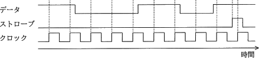
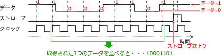

# [平成30年春期 午前 問22](https://www.ap-siken.com/kakomon/30_haru/q22.html)

#問題 #テクノロジ #ハードウェア #ハードウェア

解説を表示解説を隠す

<strong>問22</strong>　クロックの立上りエッジで，データを入力の最下位ビットに取り込んで上位方向へシフトし，ストローブの立上りエッジで値を確定する8ビットのシリアル入力パラレル出力シフトレジスタがある。各信号の波形を観測した結果が図のとおりであるとき，確定後のシフトレジスタの値はどれか。ここで，数値は16進数で表記している。 

<ul class="ap-choices">
<li class="ap-choice-item ap-wrong">

ア　63

本問で取り込まれる<a href="用語/ビット" class="internal-link" data-href="用語/ビット">ビット</a>列「10001101」とは異なる値です。

</li>
<li class="ap-choice-item ap-correct">

イ　8D

正しい。ストローブ立上り前の8回分の取得<a href="用語/ビット" class="internal-link" data-href="用語/ビット">ビット</a>「10001101」を16進数にしたものです。

</li>
<li class="ap-choice-item ap-wrong">

ウ　B1

<a href="用語/ビット" class="internal-link" data-href="用語/ビット">ビット</a>列を逆順に並べた「10110001」の値です。

</li>
<li class="ap-choice-item ap-wrong">

エ　C6

本問で取り込まれる<a href="用語/ビット" class="internal-link" data-href="用語/ビット">ビット</a>列「10001101」とは異なる値です。

</li>
</ul>

<h4>解説</h4>

設問の図に、クロックの立上りエッジで取り込まれる<a href="用語/ビット" class="internal-link" data-href="用語/ビット">ビット</a>(0 or 1)を書き込むと次のようになります。

データは取り込まれるごとに上位<a href="用語/ビット" class="internal-link" data-href="用語/ビット">ビット</a>にシフトされていくので、シフト<a href="用語/レジスタ" class="internal-link" data-href="用語/レジスタ">レジスタ</a>の<a href="用語/ビット" class="internal-link" data-href="用語/ビット">ビット</a>の並びは、ストローブの立上り直前に取得されたデータが最下位<a href="用語/ビット" class="internal-link" data-href="用語/ビット">ビット</a>、その1つ前のデータが最下位から数えて2<a href="用語/ビット" class="internal-link" data-href="用語/ビット">ビット</a>目…というようになっています。

ストローブ立上り前の8回分の取得<a href="用語/ビット" class="internal-link" data-href="用語/ビット">ビット</a>を並べると「10001101」ですので、これを16進数に変換した8Dが正解となります。

