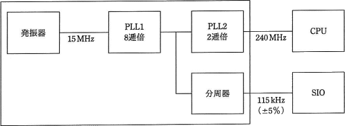
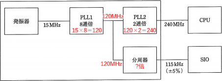

# [平成30年春期 午前 問23](https://www.ap-siken.com/kakomon/30_haru/q23.html)

#問題 #テクノロジ #ハードウェア #ハードウェア

解説を表示解説を隠す

<strong>問23</strong>　ワンチップマイコンにおける内部クロック発生器のブロック図を示す。15MHzの発振器と，内部のPLL1，PLL2及び分周器の組合せでCPUに240MHz，シリアル通信(SIO)に115kHzのクロック信号を供給する場合の分周器の値は幾らか。ここで，シリアル通信のクロック精度は±5%以内に収まればよいものとする。 

<ul class="ap-choices">
<li class="ap-choice-item ap-wrong">

ア　1／24

1／16であり、約1／1000が必要な分周比としては小さすぎる。

</li>
<li class="ap-choice-item ap-wrong">

イ　1／26

1／64であり、必要な約1／1000の分周比には足りない。

</li>
<li class="ap-choice-item ap-wrong">

ウ　1／28

1／256であり、1000に最も近い2の累乗（1024）ではない。

</li>
<li class="ap-choice-item ap-correct">

エ　1／210

正しい。約1／1000に最も近い2の累乗は1024＝210である。

</li>
</ul>

<h4>解説</h4>

発振器から出力された15MHzは、PLL1で8倍にされて120MHzになります。その後PLL2でさらに2倍されて240MHzのクロック信号が<a href="用語/CPU" class="internal-link" data-href="用語/CPU">CPU</a>に届けられます。

問題の分周器の値ですが、分周器への入力が120MHz、SIO(シリアル通信)に供給されるクロック信号は115kHzなので、およそ1／1000の値になっていることに気が付きます。

120×106÷(115×103)≒103

よって、分周器の値は約1／1000に設定すればよいことになります。1000を2の累乗で表すと最も近いのが「1024＝210」ですから、答えは1／210となります。

