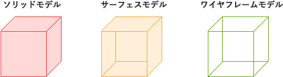

# [平成30年春期 午前 問25](https://www.ap-siken.com/kakomon/30_haru/q25.html)

#問題 #テクノロジ #情報メディア #マルチメディア応用

解説を表示解説を隠す

<strong>問25</strong>　3次元の物体を表すコンピュータグラフィックスの手法に関する記述のうち，サーフェスモデルの説明として，適切なものはどれか。

<ul class="ap-choices">
<li class="ap-choice-item ap-wrong">

ア　物体を，頂点と頂点をつなぐ線で結び、針金で構成されているように表現する。

これはワイヤフレームモデルの説明です

</li>
<li class="ap-choice-item ap-wrong">

イ　物体を，中身の詰まった固形物として表現する。

これはソリッドモデルの説明です

</li>
<li class="ap-choice-item ap-correct">

ウ　物体を，ポリゴンや曲面パッチを用いて表現する。

正しい。詳細：サーフェスモデル

</li>
<li class="ap-choice-item ap-wrong">

エ　物体を，メタボールと呼ぶ構造を使い、球体を変形させることで得られる滑らかな曲線で表現する。

これはメタボールの説明です

</li>
</ul>

<h4>解説</h4>

サーフェスモデルは、3次元の<a href="用語/CG" class="internal-link" data-href="用語/CG">CG</a>において表面のみが定義された3次元構造、またはそれらを作成する目的のモデリング体系のことです。中身が詰まっていないため張り子、張りぼてとも形容されます。

