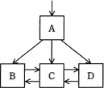
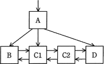
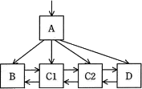
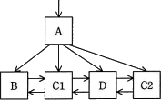
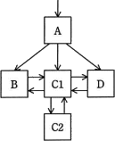
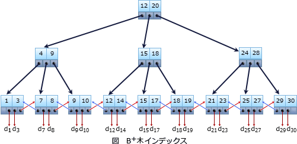

# [平成30年春期 午前 問26](https://www.ap-siken.com/kakomon/30_haru/q26.html)

#問題 #テクノロジ #データベース #トランザクション処理

解説を表示解説を隠す

<strong>問26</strong>　関係データベースのテーブルにレコードを1件追加したところ，インデックスとして使う，図のB+木のリーフノードCがノードC1とC2に分割された。ノード分割後のB+木構造はどれか。ここで，矢印はノードへのポインタとする。また，中間ノードAには十分な空きがあるものとする。 

<ul class="ap-choices">
<li class="ap-choice-item ap-wrong">

ア　

一見すると木の深さが同じように見えますが、AがC2へのポインタを持っていません。B・C1・Dには1回でアクセスできますが、C2へのアクセスにはポインタを2回参照する必要があります。よって、距離が一定という条件を満たしていません。

</li>
<li class="ap-choice-item ap-correct">

イ　

正しい。木の深さが一定であり、それぞれの葉ノードのリンクが順序関係を保っているため、適切なB+木です。

</li>
<li class="ap-choice-item ap-wrong">

ウ　

CがC1とC2に分割されたため、B⇄C1⇄C2⇄D という順序関係になるはずです。C2の挿入位置が不適切で葉ノードの順序関係が崩れているので、B+木の条件を満たしません。

</li>
<li class="ap-choice-item ap-wrong">

エ　

木の深さが一定ではないのでB+木の条件を満たしません。

</li>
</ul>

<h4>解説</h4>

B+木<a href="用語/インデックス" class="internal-link" data-href="用語/インデックス">インデックス</a>は、木の深さが一定で、節点はキー値と子部分木へのポインタをもち、葉のみが値をもつ平衡木（<a href="用語/バランス木" class="internal-link" data-href="用語/バランス木">バランス木</a>）を用いた<a href="用語/インデックス" class="internal-link" data-href="用語/インデックス">インデックス</a>法です。関係<a href="用語/データベース" class="internal-link" data-href="用語/データベース">データベース</a>の<a href="用語/インデックス" class="internal-link" data-href="用語/インデックス">インデックス</a>法として現在最も普及しています。

<a href="用語/B木" class="internal-link" data-href="用語/B木">B木</a>やB+木において1つの節点に格納できるデータの個数は「次数」という数値で決まります。次数NのB+木の条件は次のとおりです。 ・根から葉までの距離が等しい ・節は2×N個以下のキー値をもつ ・根以外の節はN個以上のキー値をもつ ・節は格納するキー値の数＋1個の枝（ポインタ）をもつ ・データは葉のみに格納される ・葉どうしは横方向の<a href="用語/リスト" class="internal-link" data-href="用語/リスト">リスト</a>として連結されている

