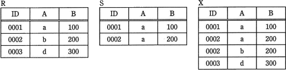
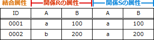
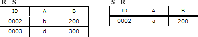
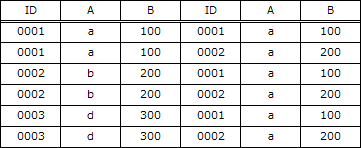
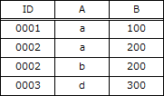

# [平成30年春期 午前 問27](https://www.ap-siken.com/kakomon/30_haru/q27.html)

#問題 #テクノロジ #データベース #データ操作

解説を表示解説を隠す

<strong>問27</strong>　関係Rと関係Sに対して，関係Xを求める関係演算はどれか。 

<ul class="ap-choices">
<li class="ap-choice-item ap-wrong">

ア　IDで結合

2つの表が共通して持つ<a href="用語/属性" class="internal-link" data-href="用語/属性">属性</a>(列)を基準に結合を行い、新しい表をつくりだす演算です。設問の<a href="用語/関係" class="internal-link" data-href="用語/関係">関係</a>Xとは結果が一致しません。

</li>
<li class="ap-choice-item ap-wrong">

イ　差

一方の<a href="用語/関係" class="internal-link" data-href="用語/関係">関係</a>に属する行から他方の<a href="用語/関係" class="internal-link" data-href="用語/関係">関係</a>に属する行を取り除いた表を返す演算です。設問の<a href="用語/関係" class="internal-link" data-href="用語/関係">関係</a>Xとは結果が一致しません。

</li>
<li class="ap-choice-item ap-wrong">

ウ　直積

<a href="用語/関係" class="internal-link" data-href="用語/関係">関係</a>Rと<a href="用語/関係" class="internal-link" data-href="用語/関係">関係</a>Sの行の全ての組合せを返す演算です。設問の<a href="用語/関係" class="internal-link" data-href="用語/関係">関係</a>Xとは結果が一致しません。

</li>
<li class="ap-choice-item ap-correct">

エ　和

正しい。和(union)は、<a href="用語/関係" class="internal-link" data-href="用語/関係">関係</a>Rまたは<a href="用語/関係" class="internal-link" data-href="用語/関係">関係</a>Sに含まれるすべての行で構成される表を返す演算です。重複する行は除外されます。設問の<a href="用語/関係" class="internal-link" data-href="用語/関係">関係</a>Xと同じになります。

</li>
</ul>

<h4>解説</h4>

結合(join)は、2つの表が共通して持つ<a href="用語/属性" class="internal-link" data-href="用語/属性">属性</a>(列)を基準に結合を行い、新しい表をつくりだす演算です。両方の<a href="用語/関係" class="internal-link" data-href="用語/関係">関係</a>に存在する結合<a href="用語/属性" class="internal-link" data-href="用語/属性">属性</a>は一方のみが表示されます。RとSをID列で(自然)結合した結果は次のようになります。 

差(difference)は、2つの<a href="用語/関係" class="internal-link" data-href="用語/関係">関係</a>があるとき、一方の<a href="用語/関係" class="internal-link" data-href="用語/関係">関係</a>に属する行から他方の<a href="用語/関係" class="internal-link" data-href="用語/関係">関係</a>に属する行を取り除いた表を返す演算です。RとSの差演算(R－S)及び(S－R)は次の結果を返します。 

直積(cartesian product)は、<a href="用語/関係" class="internal-link" data-href="用語/関係">関係</a>Rと<a href="用語/関係" class="internal-link" data-href="用語/関係">関係</a>Sの行の全ての組合せを返す演算です。演算後の行数は「Rの行数×Sの行数」になります。RとSの直積演算(R×S)は次の結果を返します。 

エは正しい。和(union)は、<a href="用語/関係" class="internal-link" data-href="用語/関係">関係</a>Rまたは<a href="用語/関係" class="internal-link" data-href="用語/関係">関係</a>Sに含まれるすべての行で構成される表を返す演算です。重複する行は除外されます。RとSの和演算(R∪S)は次の結果を返します。設問の<a href="用語/関係" class="internal-link" data-href="用語/関係">関係</a>Xと同じになります。 

