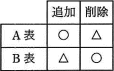
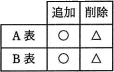
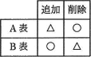
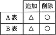
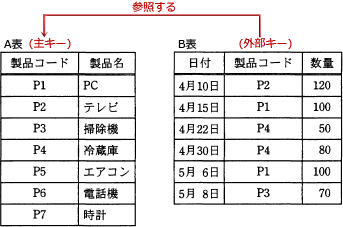

# [平成30年春期 午前 問28](https://www.ap-siken.com/kakomon/30_haru/q28.html)

#問題 #テクノロジ #データベース #トランザクション処理

解説を表示解説を隠す

<strong>問28</strong>　SQLにおいて，A表の主キーがB表の外部キーによって参照されている場合，各表の行を追加・削除する操作の参照制約について，正しく整理した図はどれか。ここで，△印は操作が拒否される場合があることを表し，○印は制限なしに操作ができることを表す。

<ul class="ap-choices">
<li class="ap-choice-item ap-correct">

ア　

正しい。A表への追加は○、A表からの削除は△、B表への追加は△、B表からの削除は○の組合せです。

</li>
<li class="ap-choice-item ap-wrong">

イ　

B表への追加を○、B表からの削除を△としている点が誤りです。B表への追加は参照先が無いと拒否されうる（△）、B表からの削除は制限なし（○）です。

</li>
<li class="ap-choice-item ap-wrong">

ウ　

A表・B表とも追加／削除の○と△が正しい組合せと逆転しています。

</li>
<li class="ap-choice-item ap-wrong">

エ　

A表への追加を△、A表からの削除を○としている点が誤りです。A表への追加は制限なし（○）、A表からの削除は参照されている行があると拒否されうる（△）です。

</li>
</ul>

<h4>解説</h4>

A表の<a href="用語/主キー" class="internal-link" data-href="用語/主キー">主キー</a>がB表の<a href="用語/外部キー" class="internal-link" data-href="用語/外部キー">外部キー</a>によって参照されている下表を例として、操作の可否を検討していきます。

[A表への追加] A表に行を追加してもB表との整合性に問題は生じないため、新たな製品コードと製品名の組を追加することができます。したがって"○"になります。

[A表からの削除] B表から参照されている製品コードP1，P2，P3，P4が削除された場合、B表がA表の存在しない行を参照することになってしまうため削除できません。B表から参照されていないP5，P6，P7の行であれば削除することが可能です。したがって"△"になります。

[B表への追加] 追加しようとする行の製品コードにA表に存在しない値(例えばP8)が指定されていた場合、B表はA表内の存在しない行を参照することになってしまうため追加できません。したがって"△"になります。

[B表からの削除] どの行を削除してもA表との整合性は保たれるので制限なく削除可能です。したがって"○"になります。

したがって適切な組合せは「ア」です。

