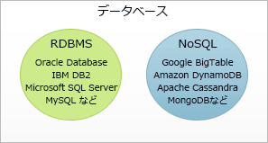
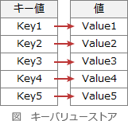

# [平成30年春期 午前 問30](https://www.ap-siken.com/kakomon/30_haru/q30.html)

#問題 #テクノロジ #データベース #データベース応用

解説を表示解説を隠す

<strong>問30</strong>　ビッグデータの基盤技術として利用されるNoSQLに分類されるデータベースはどれか。

<ul class="ap-choices">
<li class="ap-choice-item ap-wrong">

ア　関係データモデルをオブジェクト指向データモデルに拡張し，操作の定義や型の継承関係の定義を可能としたデータベース

これはオブジェクト指向データベースの説明です

</li>
<li class="ap-choice-item ap-wrong">

イ　経営者の意思決定を支援するために，ある主題に基づくデータを現在の情報とともに過去の情報も蓄積したデータベース

これは<a href="用語/データウェアハウス" class="internal-link" data-href="用語/データウェアハウス">データウェアハウス</a>の説明です

</li>
<li class="ap-choice-item ap-correct">

ウ　様々な形式のデータを一つのキーに対応付けて管理するキーバリュー型データベース

正しい。詳細：<a href="用語/キーバリュー型データベース" class="internal-link" data-href="用語/キーバリュー型データベース">キーバリュー型データベース</a>

</li>
<li class="ap-choice-item ap-wrong">

エ　データ項目の名称や形式など，データそのものの特性を表すメタ情報を管理するデータベース

これは<a href="用語/データディクショナリ" class="internal-link" data-href="用語/データディクショナリ">データディクショナリ</a>や<a href="用語/リポジトリ" class="internal-link" data-href="用語/リポジトリ">リポジトリ</a>の説明です

</li>
</ul>

<h4>解説</h4>

NoSQL(Not only <a href="用語/SQL" class="internal-link" data-href="用語/SQL">SQL</a>)は、データへのアクセス方法を<a href="用語/SQL" class="internal-link" data-href="用語/SQL">SQL</a>に限定しないデータベース管理システムの総称で、長い間決まったように使用されてきた関係データベース管理システム以外の<a href="用語/DBMS" class="internal-link" data-href="用語/DBMS">DBMS</a>という意味で用いられます。

RDBMSは長い歴史をもち、厳密なスキーマ定義や数学的に定義されたモデル理論、<a href="用語/トランザクション" class="internal-link" data-href="用語/トランザクション">トランザクション</a>の<a href="用語/ACID特性" class="internal-link" data-href="用語/ACID特性">ACID特性</a>などによって信頼性に秀でています。しかし、それゆえにデータを扱う際のコストも高くなり、<a href="用語/ビッグデータ" class="internal-link" data-href="用語/ビッグデータ">ビッグデータ</a>などの高頻度で膨大なデータを扱う場面ではパフォーマンス面での劣化が現れてきました。NoSQLは、スキーマレスで軽量なのでデータの参照や追加を低コストで実行できます。さらに<a href="用語/スケーラビリティ" class="internal-link" data-href="用語/スケーラビリティ">スケーラビリティ</a>にも優れるため大量に蓄積されていくデータを扱うのに適しています。

NoSQLには大まかに分けて4つのタイプがあります。

<ul>
<li>キー・バリュー型 … 1つのキーに1つの値を結びつけてデータを格納する</li>
<li>カラム指向 … 行キーに対してカラム（名前と値の組み合わせ）を結びつけて格納する</li>
<li>ドキュメント指向 … <a href="用語/XML" class="internal-link" data-href="用語/XML">XML</a>や<a href="用語/JSON" class="internal-link" data-href="用語/JSON">JSON</a>などの構造でデータを格納する</li>
<li>グラフ指向 … <a href="用語/グラフ理論" class="internal-link" data-href="用語/グラフ理論">グラフ理論</a>に基づいてデータ間の関係性を表現する</li>
</ul>

<a href="用語/キーバリュー型データベース" class="internal-link" data-href="用語/キーバリュー型データベース">キーバリュー型データベース</a>は、プログラミングで使用される連想配列のように、1つのキーに1つの値を結びつけてデータを格納するタイプのデータベースでNoSQLに分類されます。KVS(キーバリューストア)とも呼ばれます。 

したがって「ウ」が正解です。

