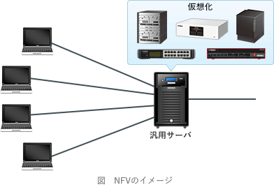

# [平成30年春期 午前 問32](https://www.ap-siken.com/kakomon/30_haru/q32.html)

#問題 #テクノロジ #ネットワーク #ネットワーク方式

解説を表示解説を隠す

<strong>問32</strong>　ETSI(欧州電気通信標準化機構)によって提案されたNFV(Network Functions Virtualisation)に関する記述として，適切なものはどれか。

<ul class="ap-choices">
<li class="ap-choice-item ap-wrong">

ア　インターネット上で地理情報システムと拡張現実の技術を利用することによって，現実空間と仮想空間をスムーズに融合させた様々なサービスを提供する。

これは<a href="用語/AR" class="internal-link" data-href="用語/AR">AR</a>の説明です

</li>
<li class="ap-choice-item ap-correct">

イ　仮想化技術を利用し，ネットワーク機能を汎用サーバ上にソフトウェアとして実現したコンポーネントを用いることによって，柔軟なネットワーク基盤を構築する。

正しい。詳細：<a href="用語/NFV" class="internal-link" data-href="用語/NFV">NFV</a>

</li>
<li class="ap-choice-item ap-wrong">

ウ　様々な入力情報に対する処理結果をニューラルネットワークに学習させることによって，画像認識や音声認識，自然言語処理などの問題に対する解を見いだす。

これは<a href="用語/ディープラーニング" class="internal-link" data-href="用語/ディープラーニング">ディープラーニング</a>の説明です

</li>
<li class="ap-choice-item ap-wrong">

エ　プレースとトランジションと呼ばれる2種類のノードをもつ有向グラフであり，システムの並列性や競合性の分析などに利用される。

これは<a href="用語/ペトリネットモデル" class="internal-link" data-href="用語/ペトリネットモデル">ペトリネットモデル</a>の説明です

</li>
</ul>

<h4>解説</h4>

<a href="用語/NFV" class="internal-link" data-href="用語/NFV">NFV</a>(Network Functions Virtualisation，ネットワーク機能の<a href="用語/仮想化" class="internal-link" data-href="用語/仮想化">仮想化</a>)は、<a href="用語/仮想化" class="internal-link" data-href="用語/仮想化">仮想化</a>技術を利用して、従来は<a href="用語/ルータ" class="internal-link" data-href="用語/ルータ">ルータ</a>、スイッチ、<a href="用語/ファイアウォール" class="internal-link" data-href="用語/ファイアウォール">ファイアウォール</a>、ロードバランサーなどの専用機器で行われていた機能を、汎用サーバ内の仮想マシン上で動くソフトウェアとして実装するアーキテクチャです。複数のネットワーク機器の機能を1つの物理サーバに集約できるため、コスト削減や信頼性向上などのメリットがあります。

<a href="用語/SDN" class="internal-link" data-href="用語/SDN">SDN</a>(Software-Defined Networking)では、ネットワーク機器の機能のうち制御部だけをソフトウェア化しましたが、<a href="用語/NFV" class="internal-link" data-href="用語/NFV">NFV</a>では機器ごと<a href="用語/仮想化" class="internal-link" data-href="用語/仮想化">仮想化</a>する点が異なります。

