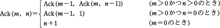
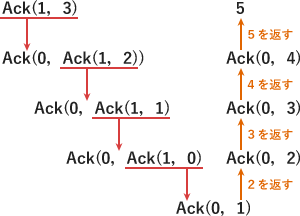

# [平成30年春期 午前 問5](https://www.ap-siken.com/kakomon/30_haru/q5.html)

#問題 #テクノロジ #アルゴリズムとプログラミング #アルゴリズム

解説を表示解説を隠す

<strong>問5</strong>　非負の整数m，nに対して次のとおりに定義された関数 Ack(m，n) がある。Ack(1，3) の値はどれか。 

<ul class="ap-choices">
<li class="ap-choice-item ap-wrong">

ア　3

定義に従って展開すると3にはならない。

</li>
<li class="ap-choice-item ap-wrong">

イ　4

定義に従って展開すると4にはならない。

</li>
<li class="ap-choice-item ap-correct">

ウ　5

正しい。<a href="用語/再帰呼出し" class="internal-link" data-href="用語/再帰呼出し">再帰呼出し</a>で定義されたAck(1，3)を展開すると5になる。

</li>
<li class="ap-choice-item ap-wrong">

エ　6

定義に従って展開すると6にはならない。

</li>
</ul>

<h4>解説</h4>

設問の再帰関数 Ack(1，3) を実行すると次のようになります。 　Ack(1，3) //Ack(1，3)は、m＞0かつn＞0 ＝Ack(0，Ack(1，2)) //Ack(1，2)は、m＞0かつn＞0 ＝Ack(0，Ack(0，Ack(1，1))) //Ack(1，1)は、m＞0かつn＞0 ＝Ack(0，Ack(0，Ack(0，Ack(1，0)))) //Ack(1，0)は、m＞0かつn＝0 ＝Ack(0，Ack(0，Ack(0，Ack(0，1)))) //Ack(0，1)は、m＝0 ＝Ack(0，Ack(0，Ack(0，2))) //Ack(0，2)は、m＝0 ＝Ack(0，Ack(0，3)) //Ack(0，3)は、m＝0 ＝Ack(0，4) //Ack(0，4)は、m＝0 ＝5 したがって「ウ」が正解です。

