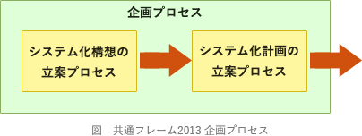

# [平成30年春期 午前 問61](https://www.ap-siken.com/kakomon/30_haru/q61.html)

#問題 #ストラテジ #システム戦略 #情報システム戦略

解説を表示解説を隠す

<strong>問61</strong>　共通フレーム2013によれば，システム化構想の立案で作成されるものはどれか。

<ul class="ap-choices">
<li class="ap-choice-item ap-correct">

ア　企業で将来的に必要となる最上位の業務機能と業務組織を表した業務の全体像

正しい。企画プロセスのシステム化構想の立案で作成されます。

</li>
<li class="ap-choice-item ap-wrong">

イ　業務手順やコンピュータ入出力情報など実現すべき要件

要件定義プロセスで作成されます。

</li>
<li class="ap-choice-item ap-wrong">

ウ　日次や月次で行う利用者業務やコンピュータ入出力作業の業務手順

運用プロセスで作成されます。

</li>
<li class="ap-choice-item ap-wrong">

エ　必要なハードウェアやソフトウェアを記述した最上位レベルのシステム方式

開発プロセスのシステム方式設計で作成されます。

</li>
</ul>

<h4>解説</h4>

システム化構想の立案は、「システム化計画の立案」に先だって実施され、<a href="用語/事業環境" class="internal-link" data-href="用語/事業環境">事業環境</a>、現行業務、<a href="用語/情報技術動向" class="internal-link" data-href="用語/情報技術動向">情報技術動向</a>などを調査した上で、<a href="用語/経営要求" class="internal-link" data-href="用語/経営要求">経営要求</a>・<a href="用語/経営課題" class="internal-link" data-href="用語/経営課題">経営課題</a>、システム化の検討対象となる業務、業務の新全体像のイメージなどを文書化し、経営者の承認を得ることを目的とするプロセスです。

