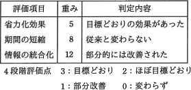

# [平成30年春期 午前 問63](https://www.ap-siken.com/kakomon/30_haru/q63.html)

#問題 #ストラテジ #システム戦略 #システム活用促進・評価

解説を表示解説を隠す

<strong>問63</strong>　定性的な評価項目を定量化するために評価点を与える方法がある。表に示す4段階評価を用いた場合，重み及び判定内容から評価されるシステム全体の目標達成度は何%となるか。 

<ul class="ap-choices">
<li class="ap-choice-item ap-wrong">

ア　27

評価点の合計（27点）そのものであり、満点75点に対する達成率ではない。

</li>
<li class="ap-choice-item ap-correct">

イ　36

正しい。27点÷75点＝0.36＝36%。

</li>
<li class="ap-choice-item ap-wrong">

ウ　43

重み付け<a href="用語/総合評価" class="internal-link" data-href="用語/総合評価">総合評価</a>の計算では得られない値です。

</li>
<li class="ap-choice-item ap-wrong">

エ　52

重み付け<a href="用語/総合評価" class="internal-link" data-href="用語/総合評価">総合評価</a>の計算では得られない値です。

</li>
</ul>

<h4>解説</h4>

重み付け<a href="用語/総合評価" class="internal-link" data-href="用語/総合評価">総合評価</a>法は、各評価項目に重要度を設定し、その重みを考慮して<a href="用語/総合評価" class="internal-link" data-href="用語/総合評価">総合評価</a>点を求め、点数の大小で比較する手法です。

まず、各評価項目ごとに判定内容に重みを付けて評価点を算出します。

<ul>
<li>省電力効果　3×5＝15点</li>
<li>期間の短縮　0×8＝0点</li>
<li>情報の統合化　1×12＝12点</li>
<li>評価点の合計　15＋0＋12＝27点</li>
</ul>

次に、全ての評価項目が「目標通り」だったときの評価点を求めます。

<ul>
<li>省電力効果　3×5＝15点</li>
<li>期間の短縮　3×8＝24点</li>
<li>情報の統合化　3×12＝36点</li>
<li>評価点の合計　15＋24＋36＝75点</li>
</ul>

満点75点に対し、評価値は27点なので、全て目標通りだった場合の評価点に対する達成率は、 27点÷75点＝0.36＝36% 以上より、正解は「イ」となります。

