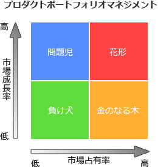

# [平成30年春期 午前 問67](https://www.ap-siken.com/kakomon/30_haru/q67.html)

#問題 #ストラテジ #経営戦略マネジメント #経営戦略手法

解説を表示解説を隠す

<strong>問67</strong>　PPMにおいて，投資用の資金源として位置付けられる事業はどれか。

<ul class="ap-choices">
<li class="ap-choice-item ap-wrong">

ア　市場成長率が高く，相対的市場占有率が高い事業

これは<a href="用語/花形製品" class="internal-link" data-href="用語/花形製品">花形製品</a>の説明です。

</li>
<li class="ap-choice-item ap-wrong">

イ　市場成長率が高く，相対的市場占有率が低い事業

これは<a href="用語/問題児" class="internal-link" data-href="用語/問題児">問題児</a>の説明です。

</li>
<li class="ap-choice-item ap-correct">

ウ　市場成長率が低く，相対的市場占有率が高い事業

正しい。詳細：<a href="用語/金のなる木" class="internal-link" data-href="用語/金のなる木">金のなる木</a>

</li>
<li class="ap-choice-item ap-wrong">

エ　市場成長率が低く，相対的市場占有率が低い事業

これは<a href="用語/負け犬" class="internal-link" data-href="用語/負け犬">負け犬</a>の説明です。

</li>
</ul>

<h4>解説</h4>

プロダクトポートフォリオマネジメント(PPM)は、縦軸と横軸に「<a href="用語/市場成長率" class="internal-link" data-href="用語/市場成長率">市場成長率</a>」と「市場占有率」を設定したマトリックス図を4つの象限に区分し，製品や事業の市場における位置付けを分析して<a href="用語/資源配分" class="internal-link" data-href="用語/資源配分">資源配分</a>を検討する手法です。

4つの象限は、市場内の位置付けから以下のような名称で呼ばれています。

<ul>
<li>花形(star) … [成長率：高、占有率：高] 占有率・成長率ともに高く、資金の流入も大きいが、成長に伴い占有率の維持には多額の資金の投入を必要とする分野</li>
<li><a href="用語/金のなる木" class="internal-link" data-href="用語/金のなる木">金のなる木</a>(cash cow) … [成長率：低、占有率：高] 市場の成長がないため追加の投資が必要ではなく、市場占有率の高さから安定した資金・利益の流入が見込める分野</li>
<li><a href="用語/問題児" class="internal-link" data-href="用語/問題児">問題児</a>(problem child) … [成長率：高、占有率：低] 成長率は高いが占有率は低いので、<a href="用語/花形製品" class="internal-link" data-href="用語/花形製品">花形製品</a>とするためには多額の投資が必要になる。投資が失敗し、そのまま成長率が下がれば<a href="用語/負け犬" class="internal-link" data-href="用語/負け犬">負け犬</a>になってしまうため、慎重な対応を必要とする分野</li>
<li><a href="用語/負け犬" class="internal-link" data-href="用語/負け犬">負け犬</a>(dog) … [成長率：低、占有率：低] 成長率・占有率がともに低く、新たな投資による利益の増加も見込めないため市場からの撤退を検討するべき分野</li>
</ul>

投資用の資金源となるのは、安定した収益が見込める「<a href="用語/金のなる木" class="internal-link" data-href="用語/金のなる木">金のなる木</a>(成長率:低，占有率:高)」に位置する事業なので「ウ」が適切です。

