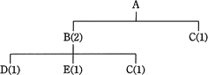
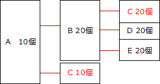

# [平成30年春期 午前 問72](https://www.ap-siken.com/kakomon/30_haru/q72.html)

#問題 #ストラテジ #企業活動 #業務分析・データ利活用

解説を表示解説を隠す

<strong>問72</strong>　図は，製品Aの構成部品を示し，括弧内の数字は上位の製品・部品1個当たりの所要数量である。この製品Aを10個生産する場合，部品Cは，少なくとも何個発注する必要があるか。ここで，現在の部品Bの在庫は0個，部品Cの在庫は5個である。 

<ul class="ap-choices">
<li class="ap-choice-item ap-wrong">

ア　15

部品B由来の部品Cだけから在庫を差し引いた場合（20－5＝15）で、製品Aに直接必要な部品Cを含めていない。

</li>
<li class="ap-choice-item ap-wrong">

イ　20

部品Bの生産に必要な部品Cの数量のみで、製品Aへの直接所要と在庫の控除を反映していない。

</li>
<li class="ap-choice-item ap-correct">

ウ　25

正しい。構成部品に沿って所要量を積み上げ、部品Cの在庫5個を差し引いた発注数である。詳細：<a href="用語/MRP" class="internal-link" data-href="用語/MRP">MRP</a>

</li>
<li class="ap-choice-item ap-wrong">

エ　30

部品Cの総所要量（10＋20＝30）であり、在庫5個を差し引いていない。

</li>
</ul>

<h4>解説</h4>

問題文と図の条件を整理します。製品Aを1つ生産するためには、部品Bが2つ、部品Cが1つ必要となる。部品Bを1つ生産するためには、部品C、部品D、部品Eがそれぞれ1つ必要となる。部品Bの在庫は0個、部品Cの在庫は5個。まず製品Aを10個生産するためには、部品Bが20個、部品Cが10個必要であるとわかります。部品Bの在庫は0個なので全20個生産するために、部品C、D、Eがそれぞれ20個必要になります。この関係を視覚化したものが以下の図です。生産に必要となる部品Cの数量は、製品Aの生産に必要な10個と部品Bの生産に必要な20個を合わせた30個です。部品Cの在庫は5個なので、発注数は所要数30個から在庫5個を差し引いた「30－5＝25個」になります。

