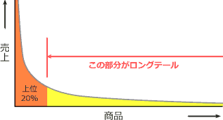

# [平成30年春期 午前 問73](https://www.ap-siken.com/kakomon/30_haru/q73.html)

#問題 #ストラテジ #ビジネスインダストリ #e-ビジネス

解説を表示解説を隠す

<strong>問73</strong>　インターネットショッピングで売上の全体に対して，あまり売れない商品の売上合計の占める割合が無視できない割合になっていることを指すものはどれか。

<ul class="ap-choices">
<li class="ap-choice-item ap-wrong">

ア　アフィリエイト

詳細：<a href="用語/アフィリエイト" class="internal-link" data-href="用語/アフィリエイト">アフィリエイト</a>

</li>
<li class="ap-choice-item ap-wrong">

イ　オプトイン

詳細：<a href="用語/オプトイン" class="internal-link" data-href="用語/オプトイン">オプトイン</a>

</li>
<li class="ap-choice-item ap-wrong">

ウ　ドロップシッピング

詳細：ドロップシッピング

</li>
<li class="ap-choice-item ap-correct">

エ　ロングテール

正しい。詳細：<a href="用語/ロングテール" class="internal-link" data-href="用語/ロングテール">ロングテール</a>

</li>
</ul>

<h4>解説</h4>

<a href="用語/ロングテール" class="internal-link" data-href="用語/ロングテール">ロングテール</a>は、膨大な商品を低コストで扱うことができるインターネットを使った商品販売において、実店舗では陳列されにくい販売機会の少ない商品でも、それらを数多く取りそろえることによって十分な売上を確保できることを説明した経済理論です。

一般に商品の売上は「全体の2割の優良顧客が全体の売上の8割を占め，全商品の上位2割が8割の売上を占める」というパレートの法則に従うので、実店舗では売場面積や物流などの問題から上位20%の商品を優先的に販売することになります。

しかし、インターネット販売では従来の小売店販売面積の制約に縛られず、商品をデータベースに登録するだけで膨大な商品点数を揃えることが可能です。この商品点数の多さを活かし、小さいけれども確かにある販売機会を大量に集めることで、実店舗では実現不可能部分で大きな売上が生じるという現象が起こります。

このような<a href="用語/ビジネスモデル" class="internal-link" data-href="用語/ビジネスモデル">ビジネスモデル</a>を説明するときに使われるのが<a href="用語/ロングテール" class="internal-link" data-href="用語/ロングテール">ロングテール</a>理論です。

名前の由来ですが、販売数を縦軸、商品を横軸にして、売上額が多い商品順に並べた<a href="用語/パレート図" class="internal-link" data-href="用語/パレート図">パレート図</a>を作成すると、販売機会の少ない商品群が低く状態で右に延びた形状になります。この右に延びた部分が恐竜の尻尾(tail)のような見た目であることから「<a href="用語/ロングテール" class="internal-link" data-href="用語/ロングテール">ロングテール</a>」と呼ばれています。

