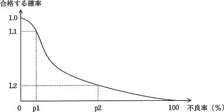
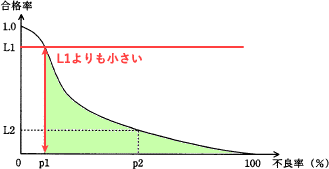
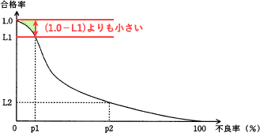
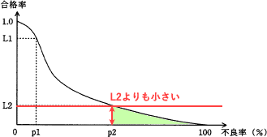
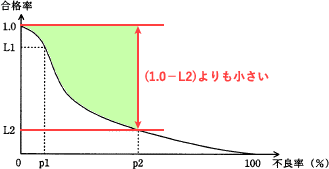

# [平成30年春期 午前 問74](https://www.ap-siken.com/kakomon/30_haru/q74.html)

#問題 #ストラテジ #企業活動 #業務分析・データ利活用

解説を表示解説を隠す

<strong>問74</strong>　図は，ある製品ロットの抜取り検査の結果を表すOC曲線(検査特性曲線)である。この図が表しているものはどれか。 

<ul class="ap-choices">
<li class="ap-choice-item ap-wrong">

ア　p1％よりも大きい不良率のロットが合格する確率は，L1よりも大きい。

<a href="用語/不良率" class="internal-link" data-href="用語/不良率">不良率</a>がp1％を超えて大きくなると、合格率はL1よりも小さくなる。

</li>
<li class="ap-choice-item ap-wrong">

イ　p1％よりも小さい不良率のロットが不合格となる確率は，(1.0－L1)よりも大きい。

<a href="用語/不良率" class="internal-link" data-href="用語/不良率">不良率</a>がp1％より小さいロットの不合格確率は、(1.0－L1)よりも小さくなる。

</li>
<li class="ap-choice-item ap-correct">

ウ　p2％よりも大きい不良率のロットが合格する確率は，L2よりも小さい。

正しい。<a href="用語/不良率" class="internal-link" data-href="用語/不良率">不良率</a>がp2％を超えて大きくなると、合格率はL2よりも小さくなる。

</li>
<li class="ap-choice-item ap-wrong">

エ　p2％よりも小さい不良率のロットが不合格となる確率は，L2よりも小さい。

不合格確率は(1.0－L2)よりも小さくなり、L2が0.5未満のとき不合格率はL2を上回るため誤り。

</li>
</ul>

<h4>解説</h4>

<a href="用語/OC曲線" class="internal-link" data-href="用語/OC曲線">OC曲線</a>(Operating Characteristic curve)は、製品の<a href="用語/抜き取り検査" class="internal-link" data-href="用語/抜き取り検査">抜き取り検査</a>をする際のロットの<a href="用語/不良率" class="internal-link" data-href="用語/不良率">不良率</a>とそのロットの合格率の関係を表したものです。ロットの<a href="用語/不良率" class="internal-link" data-href="用語/不良率">不良率</a>がnである場合にロットの合格率が一意に決まることを示します。

<a href="用語/不良率" class="internal-link" data-href="用語/不良率">不良率</a>がP1%のロットが検査に合格する確率は L1 です。<a href="用語/不良率" class="internal-link" data-href="用語/不良率">不良率</a>がP1%を超えて大きくなると、合格率は L1 よりも小さくなります。 

<a href="用語/不良率" class="internal-link" data-href="用語/不良率">不良率</a>がP1%より小さいロットが検査に不合格となる確率は (1.0－L1) よりも小さくなります。 

正しい。<a href="用語/不良率" class="internal-link" data-href="用語/不良率">不良率</a>がP2%のロットが検査に合格する確率は L2 です。<a href="用語/不良率" class="internal-link" data-href="用語/不良率">不良率</a>がP2%を超えて大きくなると、合格率は L2 よりも小さくなります。 

<a href="用語/不良率" class="internal-link" data-href="用語/不良率">不良率</a>がP2%より小さいロットが検査に不合格となる確率は (1.0－L2) よりも小さくなります。本問の図のように L2 が0.5を下回るとき、<a href="用語/不良率" class="internal-link" data-href="用語/不良率">不良率</a>がP2より小さいロットの不合格率(1.0－L2)は L2 を上回るので、L2 より小さいとする本肢は誤りです。 

