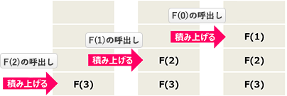
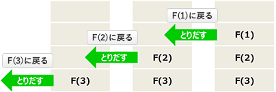

# [平成30年春期 午前 問8](https://www.ap-siken.com/kakomon/30_haru/q8.html)

#問題 #テクノロジ #アルゴリズムとプログラミング #データ構造

解説を表示解説を隠す

<strong>問8</strong>　再帰的な処理を実現するためには，再帰的に呼び出したときのレジスタ及びメモリの内容を保存しておく必要がある。そのための記憶管理方式はどれか。

<ul class="ap-choices">
<li class="ap-choice-item ap-wrong">

ア　FIFO

詳細：<a href="用語/FIFO" class="internal-link" data-href="用語/FIFO">FIFO</a>

</li>
<li class="ap-choice-item ap-wrong">

イ　LFU

Least Frequently Used。参照頻度が最も低いものを置換対象とする方式です。

</li>
<li class="ap-choice-item ap-correct">

ウ　LIFO

正しい。詳細：<a href="用語/スタック" class="internal-link" data-href="用語/スタック">スタック</a>

</li>
<li class="ap-choice-item ap-wrong">

エ　LRU

詳細：<a href="用語/LRU" class="internal-link" data-href="用語/LRU">LRU</a>

</li>
</ul>

<h4>解説</h4>

再帰とは、実行中に自分自身を呼び出すことをいい、<a href="用語/再帰呼出し" class="internal-link" data-href="用語/再帰呼出し">再帰呼出し</a>を行っても正しい結果を返すことができる性質をもつプログラムを「再帰的プログラム」といいます。

少し長くなりますが、再帰関数の動作を理解するために例を挙げて説明します。例えば、nの<a href="用語/階乗" class="internal-link" data-href="用語/階乗">階乗</a>を再帰的に計算する関数F(n)が次のように定義されていたとします。(nは非負の整数です)

n＞0のとき、F(n)＝n×F(n－1) n＝0のとき、F(n)＝1

<a href="用語/階乗" class="internal-link" data-href="用語/階乗">階乗</a>とは、1からある自然数nまでの相乗のことをいい、n の<a href="用語/階乗" class="internal-link" data-href="用語/階乗">階乗</a>は記号 ! を使って「n!」と表記されます。例えば 3! であれば、3×2×1＝6 というように計算します。

関数F(n)を用いて 3! を計算すると、以下のように実行途中で自分自身の呼び出しを伴います。

F(3)＝3×F(3－1) //自分自身 F(2)を呼び出す F(2)＝2×F(2－1) //F(1)を呼び出す F(1)＝1×F(1－1) //F(0)を呼び出す F(0)＝1 //F(1)の処理に戻る F(1)＝1×1＝1 //F(2)の処理に戻る F(2)＝2×1＝2 //F(3)の処理に戻る F(3)＝3×2＝6

上記のように再帰的な処理では、ある関数の処理中に同じ関数（自分自身）を呼び出し、呼び出した関数の処理が終わると呼出し元の処理に戻ります。このような手順で処理されるため、最終的に正しい結果を得るためには、自分自身を呼び出した時点での呼出し元側の途中経過を記憶しておかなければなりません。再帰的な処理では、実行中に自分自身が呼び出された場合にそこまでの実行途中の状態を、<a href="用語/スタック" class="internal-link" data-href="用語/スタック">スタック</a>と呼ばれる<a href="用語/データ構造" class="internal-link" data-href="用語/データ構造">データ構造</a>に格納しておきます。

そして、n＝0のときにF(0)が1を返し、呼出し元の処理に戻っていく過程では、最後に積み上げたものから順にF(1)、F(2)、F(3)と値が返ってきて計算されます。

上記のように、再帰的な処理では A1→A2→A3 の順でプログラムを呼び出した場合、A3→A2→A1 というように後から入れたものから順にその値を使用します。つまり再帰的な処理は、LIFO（Last-In First-Out，後入れ先出し）の<a href="用語/記憶管理" class="internal-link" data-href="用語/記憶管理">記憶管理</a>方式を用いて実現されています。

したがって正解は「ウ」です。

