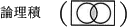
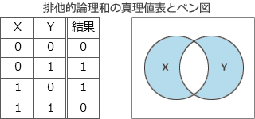
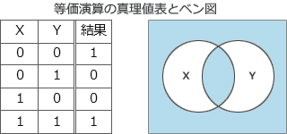

# [平成30年秋期 午前 問1](https://www.ap-siken.com/kakomon/30_aki/q1.html)

#問題 #テクノロジ #基礎理論 #離散数学

解説を表示解説を隠す

<strong>問1</strong>　任意のオペランドに対するブール演算Aの結果とブール演算Bの結果が互いに否定の関係にあるとき，AはBの(又は，BはAの)相補演算であるという。排他的論理和の相補演算はどれか。

<ul class="ap-choices">
<li class="ap-choice-item ap-correct">

ア　

正しい。<a href="用語/排他的論理和" class="internal-link" data-href="用語/排他的論理和">排他的論理和</a>の相補演算（等価演算）。

</li>
<li class="ap-choice-item ap-wrong">

イ　

詳細：<a href="用語/否定論理和" class="internal-link" data-href="用語/否定論理和">否定論理和</a>

</li>
<li class="ap-choice-item ap-wrong">

ウ　

詳細：<a href="用語/論理積" class="internal-link" data-href="用語/論理積">論理積</a>

</li>
<li class="ap-choice-item ap-wrong">

エ　

詳細：<a href="用語/論理和" class="internal-link" data-href="用語/論理和">論理和</a>

</li>
</ul>

<h4>解説</h4>

相補演算とは、集合演算によって得られる結果が互いにもう一方の演算の<a href="用語/補集合" class="internal-link" data-href="用語/補集合">補集合</a>となっている関係、すなわちAとA，X AND YとNOT (X AND Y)のような関係になっているものをいいます。<a href="用語/排他的論理和" class="internal-link" data-href="用語/排他的論理和">排他的論理和</a>(XOR)は、2つの入力値が異なれば真、同じであれば偽を返す論理演算で、演算結果は次のような<a href="用語/真理値表" class="internal-link" data-href="用語/真理値表">真理値表</a>となります。

<a href="用語/排他的論理和" class="internal-link" data-href="用語/排他的論理和">排他的論理和</a>の相補演算になるのは、XORの<a href="用語/補集合" class="internal-link" data-href="用語/補集合">補集合</a>(XORの<a href="用語/ベン図" class="internal-link" data-href="用語/ベン図">ベン図</a>の白い部分)が結果として得られる演算なので、答えとして適切なのは「等価演算」ということになります。

