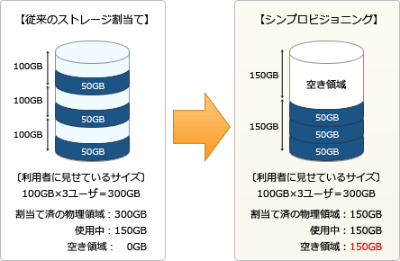

# [平成30年秋期 午前 問11](https://www.ap-siken.com/kakomon/30_aki/q11.html)

#問題 #テクノロジ #システム構成要素 #システムの構成

解説を表示解説を隠す

<strong>問11</strong>　ストレージ技術におけるシンプロビジョニングの説明として，適切なものはどれか。

<ul class="ap-choices">
<li class="ap-choice-item ap-wrong">

ア　同じデータを複数台のハードディスクに書き込み，冗長化する。

これは<a href="用語/ミラーリング" class="internal-link" data-href="用語/ミラーリング">ミラーリング</a>の説明です。

</li>
<li class="ap-choice-item ap-wrong">

イ　一つのハードディスクを，OSをインストールする領域とデータを保存する領域とに分割する。

これはパーティション分割の説明です。

</li>
<li class="ap-choice-item ap-wrong">

ウ　ファイバチャネルなどを用いてストレージをネットワーク化する。

これは<a href="用語/SAN" class="internal-link" data-href="用語/SAN">SAN</a>の説明です。

</li>
<li class="ap-choice-item ap-correct">

エ　利用者の要求に対して仮想ボリュームを提供し，物理ディスクは実際の使用量に応じて割り当てる。

正しい。詳細：シンプロビジョニング

</li>
</ul>

<h4>解説</h4>

シンプロビジョニング(Thin Provisioning)は、<a href="用語/ハードディスク装置" class="internal-link" data-href="用語/ハードディスク装置">ハードディスク装置</a>などの外部記憶装置(ストレージ)群を<a href="用語/仮想化" class="internal-link" data-href="用語/仮想化">仮想化</a>することで、物理的な記憶容量より多くの容量を利用者に割り当てることを可能にする仕組みです。

利用者の要求する記憶容量を最初から物理ディスク容量として割り当てると、未使用の物理ディスク領域が多くなり無駄が生じます。シンプロビジョニング機能が導入されたストレージでは、利用者の要求に応じて今後使用する予定の最大容量を割り当てておいて、実際の内部では使った分だけの物理容量を割り当てるということを行います。

例えば利用者の要求容量が10TBで実使用量が2TBの場合、10TBの物理ディスク容量を割り当てた場合では8TBの無駄が生じますが、仮想<a href="用語/ボリューム" class="internal-link" data-href="用語/ボリューム">ボリューム</a>として10TBを割り当てた場合では使用する物理ディスク容量は2TBで済み、さらに同様の利用者4名分のデータ(8TB)を保存することができるため物理ディスクの効率的な利用ができるというわけです。

