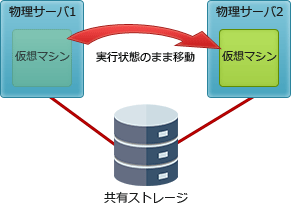

# [平成30年秋期 午前 問12](https://www.ap-siken.com/kakomon/30_aki/q12.html)

#問題 #テクノロジ #システム構成要素 #システムの構成

解説を表示解説を隠す

<strong>問12</strong>　仮想サーバの運用サービスで使用するライブマイグレーションの概念を説明したものはどれか。

<ul class="ap-choices">
<li class="ap-choice-item ap-correct">

ア　仮想サーバで稼働しているOSやソフトウェアを停止することなく，他の物理サーバへ移し替える技術である。

正しい。詳細：ライブ<a href="用語/マイグレーション" class="internal-link" data-href="用語/マイグレーション">マイグレーション</a>

</li>
<li class="ap-choice-item ap-wrong">

イ　データの利用目的や頻度などに応じて，データを格納するのに適したストレージヘ自動的に配置することによって，情報活用とストレージ活用を高める技術である。

これはストレージ自動階層化の説明です。

</li>
<li class="ap-choice-item ap-wrong">

ウ　複数の利用者でサーバやデータベースを共有しながら，利用者ごとにデータベースの内容を明確に分離する技術である。

これはマルチテナントの説明です。

</li>
<li class="ap-choice-item ap-wrong">

エ　利用者の要求に応じてリソースを動的に割り当てたり，不要になったリソースを回収して別の利用者のために移し替えたりする技術である。

これはリソース<a href="用語/オンデマンド" class="internal-link" data-href="用語/オンデマンド">オンデマンド</a>の説明です。

</li>
</ul>

<h4>解説</h4>

ライブ<a href="用語/マイグレーション" class="internal-link" data-href="用語/マイグレーション">マイグレーション</a>(Live Migration)は、ある物理サーバ上で稼働している仮想マシンを、OSやソフトウェアを停止させることなく別の物理サーバに移し替え、処理を継続させる技術です。切り替えによるダウンタイムはほとんどゼロで、移動前の処理やセッションが全て引き継がれるため<a href="用語/可用性" class="internal-link" data-href="用語/可用性">可用性</a>を損なうことがありません。

"Migration"には「移動」や「移住」などの意味があり、"live"は「生で」「生の」と訳されるので、2つを繋げた"Live Migration"は、アプリケーションを実行状態のまま移動させる技術ということを表しています。

