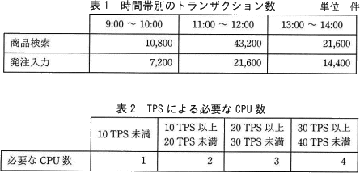

# [平成30年秋期 午前 問13](https://www.ap-siken.com/kakomon/30_aki/q13.html)

#問題 #テクノロジ #システム構成要素 #システムの構成

解説を表示解説を隠す

<strong>問13</strong>　商品検索と発注入力が可能なWebシステムについて，時間帯別のトランザクション数を表1に，TPS(Transaction Per Second)による必要なCPU数を表2に示す。このWebシステムに必要かつ十分なCPU数は幾つか。ここで，OSのオーバーヘッドなどの処理については無視でき，トランザクションはそれぞれ時間帯の中で均等に発生するものとする。 

<ul class="ap-choices">
<li class="ap-choice-item ap-wrong">

ア　1

ピーク時のTPSは18であり、必要な<a href="用語/CPU" class="internal-link" data-href="用語/CPU">CPU</a>数は2。1では不足する。

</li>
<li class="ap-choice-item ap-correct">

イ　2

正しい。ピーク時TPS18は「10TPS以上20TPS未満」に該当し、<a href="用語/CPU" class="internal-link" data-href="用語/CPU">CPU</a>数は2。

</li>
<li class="ap-choice-item ap-wrong">

ウ　3

ピーク時に必要なのは2。3は過剰である。

</li>
<li class="ap-choice-item ap-wrong">

エ　4

ピーク時に必要なのは2。4は過剰である。

</li>
</ul>

<h4>解説</h4>

この<a href="用語/Webシステム" class="internal-link" data-href="用語/Webシステム">Webシステム</a>が最も混雑するのは11：00～12:00ですので、この時間帯の<a href="用語/トランザクション" class="internal-link" data-href="用語/トランザクション">トランザクション</a>数を基準に必要な<a href="用語/CPU" class="internal-link" data-href="用語/CPU">CPU</a>数を求めます。

11：00～12:00の時間帯は、商品検索と発注入力を合わせると1時間の間に(43,200＋21,600=)64,800回の<a href="用語/トランザクション" class="internal-link" data-href="用語/トランザクション">トランザクション</a>が発生します。つまり、この時間帯のTPS(1秒あたりの<a href="用語/トランザクション" class="internal-link" data-href="用語/トランザクション">トランザクション</a>数)は、

64,800回÷3,600秒＝18回

です。この18回を「表2 TPSと必要な<a href="用語/CPU" class="internal-link" data-href="用語/CPU">CPU</a>数の関係」に照らし合わせると、TPSが「10TPS以上20TPS未満」のところに該当するので、必要な<a href="用語/CPU" class="internal-link" data-href="用語/CPU">CPU</a>数は「2つ」となります。

