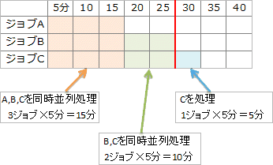

# [平成30年秋期 午前 問16](https://www.ap-siken.com/kakomon/30_aki/q16.html)

#問題 #テクノロジ #ソフトウェア #オペレーティングシステム

解説を表示解説を隠す

<strong>問16</strong>　処理はすべてCPU処理である三つのジョブ A，B，C がある。それらを単独で実行したときの処理時間は，ジョブAは5分，ジョブBは10分，ジョブCは15分である。この三つのジョブを次のスケジューリング方式に基づいて同時に開始すると，ジョブBが終了するまでの経過時間はおよそ何分か。 〔スケジューリング方式〕一定時間(これをタイムクウォンタムと呼ぶ)内に処理が終了しなければ，処理を中断させて，待ち行列の最後尾へ回す。待ち行列に並んだ順に実行する。タイムクウォンタムは，ジョブの処理時間に比べて十分に小さい値とする。ジョブの切替え時間は考慮しないものとする。

<ul class="ap-choices">
<li class="ap-choice-item ap-wrong">

ア　15

ジョブA完了時点の経過時間であり、ジョブBはまだ終了していません。

</li>
<li class="ap-choice-item ap-wrong">

イ　20

ジョブA終了後の残り時間の見積もりを誤った値です。

</li>
<li class="ap-choice-item ap-correct">

ウ　25

正しい。ジョブA完了まで15分＋その後ジョブB完了まで10分＝25分です。

</li>
<li class="ap-choice-item ap-wrong">

エ　30

3ジョブの処理時間の合計であり、並行実行を考慮していません。

</li>
</ul>

<h4>解説</h4>

〔<a href="用語/スケジューリング" class="internal-link" data-href="用語/スケジューリング">スケジューリング</a>方式〕の説明より、3つのジョブは<a href="用語/マルチタスク" class="internal-link" data-href="用語/マルチタスク">マルチタスク</a>的に並行して実行されていくことがわかります。 当初は3つのジョブを同時に実行していくので、<a href="用語/CPU" class="internal-link" data-href="用語/CPU">CPU</a>時間は、3つのジョブに平均的に割り当てられていきます。処理を進めていくと、まず開始から15分時点でジョブA（処理時間5分）が完了します。15分のうち1／3がジョブAに割り当てられるためです。この時点で、ジョブBとジョブCも全体のうち5分間の処理が完了していることになります。 ジョブAの終了後は、<a href="用語/CPU" class="internal-link" data-href="用語/CPU">CPU</a>時間は2つのジョブに割り当てられます。ジョブBの残り時間は「10分－5分＝5分」で、<a href="用語/CPU" class="internal-link" data-href="用語/CPU">CPU</a>時間の1／2が割り当てられるので、ジョブBの終了はジョブAの終了後10分後となることがわかります。したがって、ジョブB完了までに要する時間は「15＋10＝25分」です。

