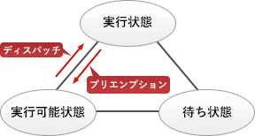

# [平成30年秋期 午前 問17](https://www.ap-siken.com/kakomon/30_aki/q17.html)

#問題 #テクノロジ #ソフトウェア #オペレーティングシステム

解説を表示解説を隠す

<strong>問17</strong>　プリエンプション方式のタスクスケジューリングにおいて，タスクBの実行中にプリエンプションが発生する契機となるのはどれか。ここで，タスクの優先度は，タスクAが最も高く，タスクA＞タスクB＝タスクC＞タスクDの関係とする。

<ul class="ap-choices">
<li class="ap-choice-item ap-correct">

ア　タスクAが実行可能状態になった。

正しい。<a href="用語/タスク" class="internal-link" data-href="用語/タスク">タスク</a>Bより<a href="用語/優先度" class="internal-link" data-href="用語/優先度">優先度</a>の高い<a href="用語/タスク" class="internal-link" data-href="用語/タスク">タスク</a>Aが実行可能状態になるとプリエンプションが発生する。

</li>
<li class="ap-choice-item ap-wrong">

イ　タスクBが待ち状態になった。

実行状態から待ち状態になることをプリエンプションとはいわない。

</li>
<li class="ap-choice-item ap-wrong">

ウ　タスクCが実行可能状態になった。

<a href="用語/タスク" class="internal-link" data-href="用語/タスク">タスク</a>Cは<a href="用語/タスク" class="internal-link" data-href="用語/タスク">タスク</a>Bと同じ<a href="用語/優先度" class="internal-link" data-href="用語/優先度">優先度</a>なので、実行可能状態になっただけではプリエンプションは発生しない。

</li>
<li class="ap-choice-item ap-wrong">

エ　タスクDが実行可能状態になった。

<a href="用語/タスク" class="internal-link" data-href="用語/タスク">タスク</a>Dは<a href="用語/タスク" class="internal-link" data-href="用語/タスク">タスク</a>Bより<a href="用語/優先度" class="internal-link" data-href="用語/優先度">優先度</a>が低いためプリエンプションは発生しない。

</li>
</ul>

<h4>解説</h4>

プリエンプション方式は、OSが<a href="用語/CPU" class="internal-link" data-href="用語/CPU">CPU</a>やシステム資源を管理し、<a href="用語/CPU" class="internal-link" data-href="用語/CPU">CPU</a>使用時間や<a href="用語/優先度" class="internal-link" data-href="用語/優先度">優先度</a>などによって複数の<a href="用語/タスク" class="internal-link" data-href="用語/タスク">タスク</a>を実行状態や実行可能状態へ切替えながら実行していく<a href="用語/マルチタスク" class="internal-link" data-href="用語/マルチタスク">マルチタスク</a>の方式です。

プリエンプション(Preemption)とは、実行状態にある<a href="用語/タスク" class="internal-link" data-href="用語/タスク">タスク</a>が<a href="用語/CPU" class="internal-link" data-href="用語/CPU">CPU</a>の使用権を奪われ実行可能状態に移されることをいい、以下のいずれかの状態になったときに起こります。

<ul>
<li>実行状態の<a href="用語/タスク" class="internal-link" data-href="用語/タスク">タスク</a>より<a href="用語/優先度" class="internal-link" data-href="用語/優先度">優先度</a>の高い<a href="用語/タスク" class="internal-link" data-href="用語/タスク">タスク</a>が実行可能状態になる</li>
<li>実行状態の<a href="用語/タスク" class="internal-link" data-href="用語/タスク">タスク</a>に割り当てられた<a href="用語/CPU" class="internal-link" data-href="用語/CPU">CPU</a>使用時間が満了する</li>
</ul>

なお、プリエンプションとは逆に、<a href="用語/CPU" class="internal-link" data-href="用語/CPU">CPU</a>使用権を与えられた<a href="用語/タスク" class="internal-link" data-href="用語/タスク">タスク</a>が実行状態に移されることを「<a href="用語/ディスパッチ" class="internal-link" data-href="用語/ディスパッチ">ディスパッチ</a>ング」といいます。

【ア】正しい。<a href="用語/タスク" class="internal-link" data-href="用語/タスク">タスク</a>Bより<a href="用語/優先度" class="internal-link" data-href="用語/優先度">優先度</a>の高い<a href="用語/タスク" class="internal-link" data-href="用語/タスク">タスク</a>Aが実行可能状態になると、OSは<a href="用語/タスク" class="internal-link" data-href="用語/タスク">タスク</a>Aを実行状態に移します。これに伴い、実行状態だった<a href="用語/タスク" class="internal-link" data-href="用語/タスク">タスク</a>Bは実行可能状態に移されます（プリエンプションの発生）。

【イ】実行状態から待ち状態になることをプリエンプションとはいいません。

【ウ】<a href="用語/タスク" class="internal-link" data-href="用語/タスク">タスク</a>Cは<a href="用語/タスク" class="internal-link" data-href="用語/タスク">タスク</a>Bと同じ<a href="用語/優先度" class="internal-link" data-href="用語/優先度">優先度</a>なので、<a href="用語/タスク" class="internal-link" data-href="用語/タスク">タスク</a>Cが実行可能状態になっただけではプリエンプションは発生しません。

【エ】<a href="用語/タスク" class="internal-link" data-href="用語/タスク">タスク</a>Dは<a href="用語/タスク" class="internal-link" data-href="用語/タスク">タスク</a>Bより<a href="用語/優先度" class="internal-link" data-href="用語/優先度">優先度</a>が低いためプリエンプションは発生しません。

