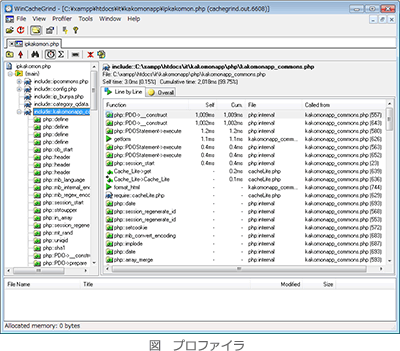

# [平成30年秋期 午前 問19](https://www.ap-siken.com/kakomon/30_aki/q19.html)

#問題 #テクノロジ #ソフトウェア #開発ツール

解説を表示解説を隠す

<strong>問19</strong>　プログラムの性能を改善するに当たって，関数，文などの実行回数や実行時間を計測して統計を取るために用いるツールはどれか。

<ul class="ap-choices">
<li class="ap-choice-item ap-wrong">

ア　コンパイラ

詳細：<a href="用語/コンパイラ" class="internal-link" data-href="用語/コンパイラ">コンパイラ</a>。ソースコードを一括翻訳して機械語の<a href="用語/目的プログラム" class="internal-link" data-href="用語/目的プログラム">目的プログラム</a>（実行ファイル／<a href="用語/ロードモジュール" class="internal-link" data-href="用語/ロードモジュール">ロードモジュール</a>）を生成する言語プロセッサであり、実行回数・実行時間の計測ツールではない。

</li>
<li class="ap-choice-item ap-wrong">

イ　デバッガ

詳細：<a href="用語/デバッガ" class="internal-link" data-href="用語/デバッガ">デバッガ</a>。デバッグ作業において<a href="用語/バグ" class="internal-link" data-href="用語/バグ">バグ</a>の発見や訂正を支援するソフトウェアであり、性能計測を主目的としない。

</li>
<li class="ap-choice-item ap-wrong">

ウ　パーサ

パーサは、ソースコードの<a href="用語/構文解析" class="internal-link" data-href="用語/構文解析">構文解析</a>を行うソフトウェアであり、実行回数・実行時間の計測ツールではない。

</li>
<li class="ap-choice-item ap-correct">

エ　プロファイラ

正しい。プロファイラは、プログラムを実行した際に関数の実行回数や処理時間などを計測する性能解析ツールである。

</li>
</ul>

<h4>解説</h4>

プロファイラ(Profiler)は、プログラムを実行した際に、どの関数が何回実行され、その処理時間がどれくらいであったかなど計測する性能解析ツールです。ボトルネックの特定や<a href="用語/パフォーマンス" class="internal-link" data-href="用語/パフォーマンス">パフォーマンス</a>の改善に役立てることができます。

したがって「エ」が正解です。

【ア】<a href="用語/コンパイラ" class="internal-link" data-href="用語/コンパイラ">コンパイラ</a>は、ソースコードを一括翻訳して、機械語の<a href="用語/目的プログラム" class="internal-link" data-href="用語/目的プログラム">目的プログラム</a>(実行ファイル／<a href="用語/ロードモジュール" class="internal-link" data-href="用語/ロードモジュール">ロードモジュール</a>)を生成する言語プロセッサです。

【イ】<a href="用語/デバッガ" class="internal-link" data-href="用語/デバッガ">デバッガ</a>は、デバッグ作業において<a href="用語/バグ" class="internal-link" data-href="用語/バグ">バグ</a>の発見や訂正を支援するソフトウェアです。

【ウ】パーサは、ソースコードの<a href="用語/構文解析" class="internal-link" data-href="用語/構文解析">構文解析</a>を行うソフトウェアです。

【エ】正しい。

