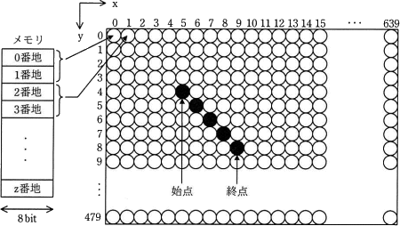

# [平成30年秋期 午前 問20](https://www.ap-siken.com/kakomon/30_aki/q20.html)

#問題 #テクノロジ #ハードウェア #ハードウェア

解説を表示解説を隠す

<strong>問20</strong>　次の方式で画素にメモリを割り当てる640×480のグラフィックLCDモジュールがある。座標(x，y)で始点(5，4)から終点(9，8)まで直線を描画するとき，直線上のx＝7の画素に割り当てられたメモリのアドレスの先頭は何番地か。 〔方式〕メモリは0番地から昇順に使用する。1画素は16ビットとする。座標(0，0)から座標(639，479)まで連続して割り当てる。各画素は，x＝0からx軸の方向にメモリを割り当てていく。x＝639の次はx＝0とし，yを1増やす。 

<ul class="ap-choices">
<li class="ap-choice-item ap-wrong">

ア　3847番地

1画素を1番地とみなしたオフセット（640×6＋7）。

</li>
<li class="ap-choice-item ap-wrong">

イ　7680番地

y＝6の行先頭のアドレス（640×6×2）。

</li>
<li class="ap-choice-item ap-correct">

ウ　7694番地

正しい。(3,848－1)×2＝7,694番地。

</li>
<li class="ap-choice-item ap-wrong">

エ　8978番地

誤った座標や計算から求めた値。

</li>
</ul>

<h4>解説</h4>

設問の図で黒く塗りつぶされている画素のうち、x＝7の座標は(7, 6)であり、図中において8列7行目に位置します。<a href="用語/メモリ" class="internal-link" data-href="用語/メモリ">メモリ</a>には上の行の画素から順に格納されていくこと、1行には640個の画素があることを踏まえると、座標(7, 6)が格納される位置は先頭から数えて、

640×縦6＋横8＝3,848番目

図より<a href="用語/メモリ" class="internal-link" data-href="用語/メモリ">メモリ</a>の各番地のサイズ8<a href="用語/ビット" class="internal-link" data-href="用語/ビット">ビット</a>、設問より1画素は16<a href="用語/ビット" class="internal-link" data-href="用語/ビット">ビット</a>なので、1つの画素を2つの番地を使って表すことになります。格納される順番ごとに<a href="用語/メモリ" class="internal-link" data-href="用語/メモリ">メモリ</a>アドレスの先頭を考えてみると、1番目の画素は<a href="用語/メモリ" class="internal-link" data-href="用語/メモリ">メモリ</a>の0番地、2番目は2番地、3番目は4番地、…、641番目(2行目先頭画素)は1,280番地 になります。これを一般化すると、n番目の画素が割り当てられる<a href="用語/メモリ" class="internal-link" data-href="用語/メモリ">メモリ</a>アドレスの先頭番地は「(n－1)×2」の式で求めることができます。

以上より、座標(7, 6)＝3,848番目の画素の<a href="用語/メモリ" class="internal-link" data-href="用語/メモリ">メモリ</a>アドレスの先頭番地は、

(3,848－1)×2＝7,694番地

したがって「ウ」が正解です。

