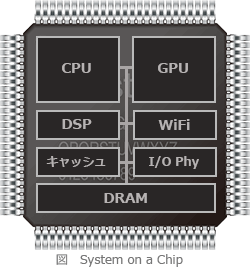

# [平成30年秋期 午前 問21](https://www.ap-siken.com/kakomon/30_aki/q21.html)

#問題 #テクノロジ #ハードウェア #ハードウェア

解説を表示解説を隠す

<strong>問21</strong>　SoCの説明として，適切なものはどれか。

<ul class="ap-choices">
<li class="ap-choice-item ap-wrong">

ア　システムLSIに内蔵されたソフトウェア

これは<a href="用語/ファームウェア" class="internal-link" data-href="用語/ファームウェア">ファームウェア</a>の説明です。<a href="用語/SoC" class="internal-link" data-href="用語/SoC">SoC</a>は、ソフトウェアではなくハードウェアであるチップ自体を示す言葉です。

</li>
<li class="ap-choice-item ap-wrong">

イ　複数のMCUを搭載したボード

マイコンボードに関する記述です。

</li>
<li class="ap-choice-item ap-correct">

ウ　複数のチップで構成していたコンピュータシステムを，一つのチップで実現したLSI

正しい。<a href="用語/SoC" class="internal-link" data-href="用語/SoC">SoC</a>の説明です。

</li>
<li class="ap-choice-item ap-wrong">

エ　複数のチップを単一のパッケージに封入してシステム化したデバイス

これはSiP(System in a Package)の説明です。

</li>
</ul>

<h4>解説</h4>

<a href="用語/SoC" class="internal-link" data-href="用語/SoC">SoC</a>(System on a Chip)は、<a href="用語/CPU" class="internal-link" data-href="用語/CPU">CPU</a>コア、<a href="用語/GPU" class="internal-link" data-href="用語/GPU">GPU</a>コア、<a href="用語/DSP" class="internal-link" data-href="用語/DSP">DSP</a>、<a href="用語/メモリ" class="internal-link" data-href="用語/メモリ">メモリ</a>、タイマー、通信モジュールなどの複数の構成要素を1つのチップ上に集約したシステム<a href="用語/LSI" class="internal-link" data-href="用語/LSI">LSI</a>(大規模集積回路)です。従来のコンピュータシステムでは、これらの構成要素は個別のチップで構成されていましたが、<a href="用語/SoC" class="internal-link" data-href="用語/SoC">SoC</a>では1つの半導体チップに必要な機能をまとめることによって、コンパクト化、高速化、<a href="用語/低消費電力化" class="internal-link" data-href="用語/低消費電力化">低消費電力化</a>、コスト削減を可能としています。<a href="用語/SoC" class="internal-link" data-href="用語/SoC">SoC</a>がワンチップであるのに対して、複数の<a href="用語/LSI" class="internal-link" data-href="用語/LSI">LSI</a>(チップ)を1つの<a href="用語/パッケージ" class="internal-link" data-href="用語/パッケージ">パッケージ</a>まとめることでシステム<a href="用語/LSI" class="internal-link" data-href="用語/LSI">LSI</a>を実現する方式をSiP(System in a Package)と言います。iPhoneに登載されているAppleのAシリーズなどが<a href="用語/SoC" class="internal-link" data-href="用語/SoC">SoC</a>の代表例です。

