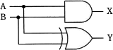
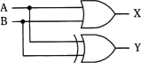
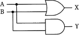
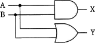
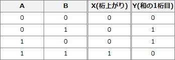
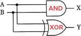

# [平成30年秋期 午前 問23](https://www.ap-siken.com/kakomon/30_aki/q23.html)

#問題 #テクノロジ #ハードウェア #ハードウェア

解説を表示解説を隠す

<strong>問23</strong>　1桁の2進数A，Bを加算し，Xに桁上がり，Yに桁上げなしの和(和の1桁目)が得られる論理回路はどれか。

<ul class="ap-choices">
<li class="ap-choice-item ap-correct">

ア　

正しい。X＝A AND B、Y＝A XOR B の関係を満たす半加算器の回路です。

</li>
<li class="ap-choice-item ap-wrong">

イ　

X（桁上がり）またはY（和）の出力が、入力A・Bとの関係として適切ではありません。

</li>
<li class="ap-choice-item ap-wrong">

ウ　

X（桁上がり）またはY（和）の出力が、入力A・Bとの関係として適切ではありません。

</li>
<li class="ap-choice-item ap-wrong">

エ　

X（桁上がり）またはY（和）の出力が、入力A・Bとの関係として適切ではありません。

</li>
</ul>

<h4>解説</h4>

入力A、Bと出力X、Yの適切な関係は次のようになります。上表を見ると、2つの入力とXの関係はANDの<a href="用語/真理値表" class="internal-link" data-href="用語/真理値表">真理値表</a>と一致し、2つの入力とYの関係はXORの<a href="用語/真理値表" class="internal-link" data-href="用語/真理値表">真理値表</a>と一致していることに気が付きます。したがって、X＝A AND B、Y＝A XOR B となっている「ア」の論理回路図が正解です。

