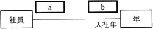
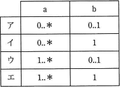
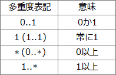
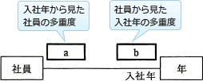

# [平成30年秋期 午前 問26](https://www.ap-siken.com/kakomon/30_aki/q26.html)

#問題 #テクノロジ #データベース #データベース設計

解説を表示解説を隠す

<strong>問26</strong>　社員と年の対応関係をUMLのクラス図で記述する。二つのクラス間の関連が次の条件を満たす場合，a，bに入れる多重度の適切な組合せはどれか。ここで，"年"クラスのインスタンスは毎年存在する。  〔条件〕 全ての社員は入社年を特定できる。 年によっては社員が入社しないこともある。  

<ul class="ap-choices">
<li class="ap-choice-item ap-wrong">

ア

aまたはbの多重度が、設問の条件から導かれる組合せと一致しません。組合せは選択肢表を参照してください。

</li>
<li class="ap-choice-item ap-correct">

イ

正しい。aは「0..*」、bは「1..1」の組合せが条件から導かれます。

</li>
<li class="ap-choice-item ap-wrong">

ウ

aまたはbの多重度が、設問の条件から導かれる組合せと一致しません。組合せは選択肢表を参照してください。

</li>
<li class="ap-choice-item ap-wrong">

エ

aまたはbの多重度が、設問の条件から導かれる組合せと一致しません。組合せは選択肢表を参照してください。

</li>
</ul>

<h4>解説</h4>

<a href="用語/クラス図" class="internal-link" data-href="用語/クラス図">クラス図</a>は<a href="用語/クラス" class="internal-link" data-href="用語/クラス">クラス</a>間の静的な関係を表す図です。多重度とは<a href="用語/関連" class="internal-link" data-href="用語/関連">関連</a>する<a href="用語/クラス" class="internal-link" data-href="用語/クラス">クラス</a>同士において、ある<a href="用語/クラス" class="internal-link" data-href="用語/クラス">クラス</a>の1つの<a href="用語/インスタンス" class="internal-link" data-href="用語/インスタンス">インスタンス</a>に別の<a href="用語/クラス" class="internal-link" data-href="用語/クラス">クラス</a>の<a href="用語/インスタンス" class="internal-link" data-href="用語/インスタンス">インスタンス</a>が対応する数を表します。

設問の図中のaには「年(入社年)から見た社員の数」、bには「社員から見たの年(入社年)の数」が表記されます。

〔aについて〕 自分が入社年の<a href="用語/インスタンス" class="internal-link" data-href="用語/インスタンス">インスタンス</a>になったつもりで考えると、入社した社員がいる年では対応する社員が1人以上いますが、社員が入社しなかった年から見れば対応する社員が0人のため"年"から見た"社員"の多重度は「0..*(0以上)」になります。

〔bについて〕 自分が社員になったつもりで考えると、入社年は必ず1つに定まるため"社員"から見た"年"の多重度は「1..1(必ず1)」になります。

したがって正しい組合せは「イ」です。

