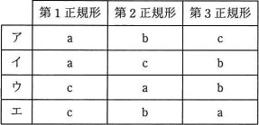

# [平成30年秋期 午前 問28](https://www.ap-siken.com/kakomon/30_aki/q28.html)

#問題 #テクノロジ #データベース #データベース設計

解説を表示解説を隠す

<strong>問28</strong>　第1，第2，第3正規形とそれらの特徴a～cの組合せとして，適切なものはどれか。 a　どの非キー属性も，主キーの真部分集合に対して関数従属しない。 b　どの非キー属性も，主キーに推移的に関数従属しない。 c　繰返し属性が存在しない。 

<ul class="ap-choices">
<li class="ap-choice-item ap-wrong">

ア

正規形と特徴a・b・cの対応が誤っています。組合せは選択肢表を参照してください。

</li>
<li class="ap-choice-item ap-wrong">

イ

正規形と特徴a・b・cの対応が誤っています。組合せは選択肢表を参照してください。

</li>
<li class="ap-choice-item ap-correct">

ウ

正しい。<a href="用語/第1正規形" class="internal-link" data-href="用語/第1正規形">第1正規形</a>がc、<a href="用語/第2正規形" class="internal-link" data-href="用語/第2正規形">第2正規形</a>がa、<a href="用語/第3正規形" class="internal-link" data-href="用語/第3正規形">第3正規形</a>がbです。

</li>
<li class="ap-choice-item ap-wrong">

エ

正規形と特徴a・b・cの対応が誤っています。組合せは選択肢表を参照してください。

</li>
</ul>

<h4>解説</h4>

第1、第2、<a href="用語/第3正規形" class="internal-link" data-href="用語/第3正規形">第3正規形</a>の条件は以下の通りです。ここで、関数従属とは一方の属性集合の値 (の集合) がもう一方の属性集合の値 (の集合) を一意に決定する関係のことをいいます。<a href="用語/第1正規形" class="internal-link" data-href="用語/第1正規形">第1正規形</a>は全ての属性が単一値である状態です。<a href="用語/第2正規形" class="internal-link" data-href="用語/第2正規形">第2正規形</a>は<a href="用語/第1正規形" class="internal-link" data-href="用語/第1正規形">第1正規形</a>を満たし、かつ、<a href="用語/主キー" class="internal-link" data-href="用語/主キー">主キー</a>に<a href="用語/部分関数従属" class="internal-link" data-href="用語/部分関数従属">部分関数従属</a>する(<a href="用語/主キー" class="internal-link" data-href="用語/主キー">主キー</a>の真部分集合に関数従属する)属性が存在しない状態です。<a href="用語/第3正規形" class="internal-link" data-href="用語/第3正規形">第3正規形</a>は<a href="用語/第2正規形" class="internal-link" data-href="用語/第2正規形">第2正規形</a>を満たし、かつ、<a href="用語/主キー" class="internal-link" data-href="用語/主キー">主キー</a>からの推移的関数従属が存在しない状態です。<a href="用語/第1正規形" class="internal-link" data-href="用語/第1正規形">第1正規形</a>がc，<a href="用語/第2正規形" class="internal-link" data-href="用語/第2正規形">第2正規形</a>がa，<a href="用語/第3正規形" class="internal-link" data-href="用語/第3正規形">第3正規形</a>がbなので、正しい組合せは「ウ」です。

