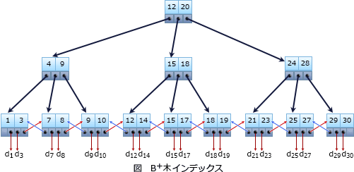

# [平成30年秋期 午前 問29](https://www.ap-siken.com/kakomon/30_aki/q29.html)

#問題 #テクノロジ #データベース #トランザクション処理

解説を表示解説を隠す

<strong>問29</strong>　"部品"表のメーカーコード列に対し，B+木インデックスを作成した。これによって，"部品"表の検索の性能改善が最も期待できる操作はどれか。ここで，部品及びメーカーのデータ件数は十分に多く，"部品"表に存在するメーカーコード列の値の種類は十分な数があり，かつ，均一に分散されているものとする。また，"部品"表のごく少数の行には，メーカーコード列にNULLが設定されている。実線の下線は主キーを，破線の下線は外部キーを表す。  　部品(<u>部品コード</u>，部品名，メーカーコード) 　メーカー(<u>メーカーコード</u>，メーカー名，住所)

<ul class="ap-choices">
<li class="ap-choice-item ap-wrong">

ア　メーカーコードの値が1001以外の部品を検索する。

否定を含む検索条件では効果を発揮できません。

</li>
<li class="ap-choice-item ap-wrong">

イ　メーカーコードの値が1001でも4001でもない部品を検索する。

否定を含む検索条件では効果を発揮できません。

</li>
<li class="ap-choice-item ap-correct">

ウ　メーカーコードの値が4001以上，4003以下の部品を検索する。

正しい。範囲検索であれば、B+木<a href="用語/インデックス" class="internal-link" data-href="用語/インデックス">インデックス</a>の効果が期待できます。

</li>
<li class="ap-choice-item ap-wrong">

エ　メーカーコードの値がNULL以外の部品を検索する。

<a href="用語/NULL" class="internal-link" data-href="用語/NULL">NULL</a>を含む検索条件では効果を発揮できません。

</li>
</ul>

<h4>解説</h4>

B+木<a href="用語/インデックス" class="internal-link" data-href="用語/インデックス">インデックス</a>は、木の深さが一定で葉のみが値をもつ平衡木を用いた<a href="用語/インデックス" class="internal-link" data-href="用語/インデックス">インデックス</a>で、RDBMSの<a href="用語/インデックス" class="internal-link" data-href="用語/インデックス">インデックス</a>法として現在最も普及しています。

B+木は、根および節にはキー値の範囲と下層のブロックへのポインタ、葉にはキー値と表内の行の位置情報と前後の葉へのポインタが格納されていて、根から節をたどっていくことで目的のデータを検索します。すべてのキー値が同じ深さにあるので、データ量が増加してもパフォーマンスの低下が少なく、どのキー値に対してもランダム検索や範囲検索、挿入・更新・削除を効率よく行える特徴を持ちます。また葉に含まれている前後の葉へのポインタによって一致検索だけでなく、"&lt;"，"&gt;"，"BETWEEN"などの範囲検索を効率よく行えます。しかしデータの分布に偏りがある場合や、<a href="用語/NULL" class="internal-link" data-href="用語/NULL">NULL</a>値及び否定を含む検索条件では効果を発揮できません。

