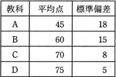
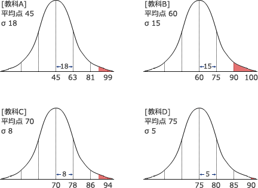

# [平成30年秋期 午前 問3](https://www.ap-siken.com/kakomon/30_aki/q3.html)

#問題 #テクノロジ #基礎理論 #応用数学

解説を表示解説を隠す

<strong>問3</strong>　受験者1,000人の4教科のテスト結果は表のとおりであり，いずれの教科の得点分布も正規分布に従っていたとする。90点以上の得点者が最も多かったと推定できる教科はどれか。 

<ul class="ap-choices">
<li class="ap-choice-item ap-wrong">

ア　A

平均と<a href="用語/標準偏差" class="internal-link" data-href="用語/標準偏差">標準偏差</a>から90点以上の割合を見ると、教科Bより少ない。

</li>
<li class="ap-choice-item ap-correct">

イ　B

正しい。<a href="用語/正規分布" class="internal-link" data-href="用語/正規分布">正規分布</a>上で90点以上の面積が最も大きい教科です。

</li>
<li class="ap-choice-item ap-wrong">

ウ　C

平均と<a href="用語/標準偏差" class="internal-link" data-href="用語/標準偏差">標準偏差</a>から90点以上の割合を見ると、教科Bより少ない。

</li>
<li class="ap-choice-item ap-wrong">

エ　D

平均と<a href="用語/標準偏差" class="internal-link" data-href="用語/標準偏差">標準偏差</a>から90点以上の割合を見ると、教科Bより少ない。

</li>
</ul>

<h4>解説</h4>

<a href="用語/正規分布" class="internal-link" data-href="用語/正規分布">正規分布</a>は、<a href="用語/平均値" class="internal-link" data-href="用語/平均値">平均値</a>を中心に左右対称の山のようなカーブを描く確率分布で、平均と<a href="用語/標準偏差" class="internal-link" data-href="用語/標準偏差">標準偏差</a>だけで分布に関する全ての特性が規定できるという特徴があります。

<a href="用語/標準偏差" class="internal-link" data-href="用語/標準偏差">標準偏差</a>は、データの分布のばらつきを表す尺度で、<a href="用語/正規分布" class="internal-link" data-href="用語/正規分布">正規分布</a>では<a href="用語/平均値" class="internal-link" data-href="用語/平均値">平均値</a>と<a href="用語/標準偏差" class="internal-link" data-href="用語/標準偏差">標準偏差</a>(σ[シグマ])、および度数の間には次の関係が成り立ちます。

<ul>
<li>平均±σの範囲に全体の約68%が含まれる</li>
<li>平均±2σの範囲に全体の約95%が含まれる</li>
<li>平均±3σの範囲に全体の約99%が含まれる</li>
</ul>

各教科の90点以上の得点者の割合は、点数分布を図で表してみると一目瞭然です(90点以上の部分を赤色で示しています)。

最も90点以上の得点者が多いのは「教科B」です。

