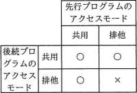
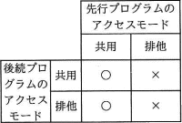
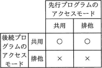
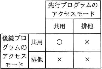
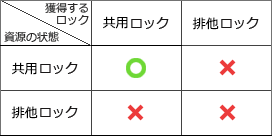

# [平成30年秋期 午前 問30](https://www.ap-siken.com/kakomon/30_aki/q30.html)

#問題 #テクノロジ #データベース #トランザクション処理

解説を表示解説を隠す

<strong>問30</strong>　データベースシステムにおいて，二つのプログラムが同一データへのアクセス要求を行うとき，後続プログラムのアクセス要求に対する並行実行の可否の組合せのうち，適切なものはどれか。ここで，表中の○は二つのプログラムが並行して実行されることを表し，×は先行プログラムの実行終了まで後続プログラムは待たされることを表す。

<ul class="ap-choices">
<li class="ap-choice-item ap-wrong">

ア　

共用<a href="用語/ロック" class="internal-link" data-href="用語/ロック">ロック</a>・排他<a href="用語/ロック" class="internal-link" data-href="用語/ロック">ロック</a>の両立性の組合せが誤っています。選択肢の表を参照してください。

</li>
<li class="ap-choice-item ap-wrong">

イ　

共用<a href="用語/ロック" class="internal-link" data-href="用語/ロック">ロック</a>・排他<a href="用語/ロック" class="internal-link" data-href="用語/ロック">ロック</a>の両立性の組合せが誤っています。選択肢の表を参照してください。

</li>
<li class="ap-choice-item ap-wrong">

ウ　

共用<a href="用語/ロック" class="internal-link" data-href="用語/ロック">ロック</a>・排他<a href="用語/ロック" class="internal-link" data-href="用語/ロック">ロック</a>の両立性の組合せが誤っています。選択肢の表を参照してください。

</li>
<li class="ap-choice-item ap-correct">

エ　

正しい。資源に共用<a href="用語/ロック" class="internal-link" data-href="用語/ロック">ロック</a>があるときのみ、後続が新たに共用<a href="用語/ロック" class="internal-link" data-href="用語/ロック">ロック</a>をかけられます。

</li>
</ul>

<h4>解説</h4>

まずは共用・排他の2種類の<a href="用語/ロック" class="internal-link" data-href="用語/ロック">ロック</a>の違いを確認しておきましょう。

共用(共有)<a href="用語/ロック" class="internal-link" data-href="用語/ロック">ロック</a> データを読込むときに使う<a href="用語/ロック" class="internal-link" data-href="用語/ロック">ロック</a>で、資源がこの状態の場合は他の<a href="用語/トランザクション" class="internal-link" data-href="用語/トランザクション">トランザクション</a>による更新処理ができなくなる(読込みは可能)。

排他(専有)<a href="用語/ロック" class="internal-link" data-href="用語/ロック">ロック</a> データを更新するときに使う<a href="用語/ロック" class="internal-link" data-href="用語/ロック">ロック</a>で、資源がこの状態の場合は他の<a href="用語/トランザクション" class="internal-link" data-href="用語/トランザクション">トランザクション</a>による読込みや更新ができなくなる。

上記の性質から、ある資源に共用または排他<a href="用語/ロック" class="internal-link" data-href="用語/ロック">ロック</a>が設定されているときの新たな<a href="用語/ロック" class="internal-link" data-href="用語/ロック">ロック</a>の可否は次の表の通りになります。

つまり、資源にかけられている<a href="用語/ロック" class="internal-link" data-href="用語/ロック">ロック</a>が"共用"である場合にのみ、後続の<a href="用語/トランザクション" class="internal-link" data-href="用語/トランザクション">トランザクション</a>が新たに"共用<a href="用語/ロック" class="internal-link" data-href="用語/ロック">ロック</a>"をかけることができます。

したがって適切な組合せは「エ」になります。

