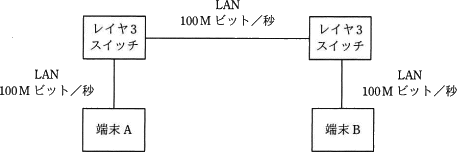
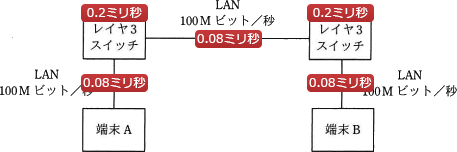

# [平成30年秋期 午前 問31](https://www.ap-siken.com/kakomon/30_aki/q31.html)

#問題 #テクノロジ #ネットワーク #ネットワーク方式

解説を表示解説を隠す

<strong>問31</strong>　2台の端末と2台のレイヤー3スイッチが図のようにLANで接続されているとき，端末Aがフレームを送信し始めてから，端末Bがそのフレームを受信し終わるまでの時間は，およそ何ミリ秒か。 〔条件〕 フレーム長：1,000バイト LANの伝送速度：100Mビット／秒 レイヤー3スイッチにおける1フレームの処理時間：0.2ミリ秒 レイヤー3スイッチは，1フレームの受信を完了してから送信を開始する。 

<ul class="ap-choices">
<li class="ap-choice-item ap-wrong">

ア　0.24

送信時間だけを合算した値に近く、スイッチの処理時間を含めていません。

</li>
<li class="ap-choice-item ap-wrong">

イ　0.43

区間数や処理時間の数え方が誤っています。

</li>
<li class="ap-choice-item ap-wrong">

ウ　0.48

送信区間または処理回数の数え方が不足しています。

</li>
<li class="ap-choice-item ap-correct">

エ　0.64

正しい。送信3回分と<a href="用語/レイヤー3スイッチ" class="internal-link" data-href="用語/レイヤー3スイッチ">レイヤー3スイッチ</a>処理2回分の合計です。

</li>
</ul>

<h4>解説</h4>

[端末Aから<a href="用語/レイヤー3スイッチ" class="internal-link" data-href="用語/レイヤー3スイッチ">レイヤー3スイッチ</a>(左)までの送信時間] <a href="用語/LAN" class="internal-link" data-href="用語/LAN">LAN</a>の伝送速度を<a href="用語/バイト" class="internal-link" data-href="用語/バイト">バイト</a>単位に直すと、 100M<a href="用語/ビット" class="internal-link" data-href="用語/ビット">ビット</a>／秒＝12.5M<a href="用語/バイト" class="internal-link" data-href="用語/バイト">バイト</a>／秒 1,000<a href="用語/バイト" class="internal-link" data-href="用語/バイト">バイト</a>の<a href="用語/フレーム" class="internal-link" data-href="用語/フレーム">フレーム</a>を12.5M<a href="用語/バイト" class="internal-link" data-href="用語/バイト">バイト</a>／秒の回線で伝送するのに要する時間は、 1,000<a href="用語/バイト" class="internal-link" data-href="用語/バイト">バイト</a>÷12.5M<a href="用語/バイト" class="internal-link" data-href="用語/バイト">バイト</a> （単位を<a href="用語/バイト" class="internal-link" data-href="用語/バイト">バイト</a>に揃えて） 1,000<a href="用語/バイト" class="internal-link" data-href="用語/バイト">バイト</a>÷12,500,000<a href="用語/バイト" class="internal-link" data-href="用語/バイト">バイト</a> ＝0.00008秒＝0.08ミリ秒 …①

[<a href="用語/レイヤー3スイッチ" class="internal-link" data-href="用語/レイヤー3スイッチ">レイヤー3スイッチ</a>(左)での処理時間] 0.2ミリ秒

[<a href="用語/レイヤー3スイッチ" class="internal-link" data-href="用語/レイヤー3スイッチ">レイヤー3スイッチ</a>(左)から<a href="用語/レイヤー3スイッチ" class="internal-link" data-href="用語/レイヤー3スイッチ">レイヤー3スイッチ</a>(右)までの送信時間] ①と同じく0.08ミリ秒

[レイヤスイッチ3(右)での処理時間] 0.2ミリ秒

[<a href="用語/レイヤー3スイッチ" class="internal-link" data-href="用語/レイヤー3スイッチ">レイヤー3スイッチ</a>(右)から端末Bまでの送信時間] ①と同じく0.08ミリ秒

以上より、合計時間は、 0.08ミリ秒×3＋0.2ミリ秒×2＝0.64ミリ秒 したがって「エ」が正解です。

