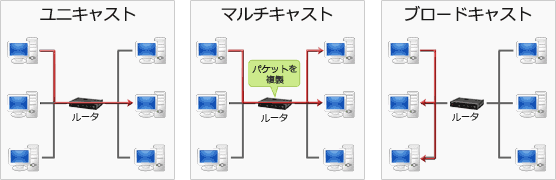

# [平成30年秋期 午前 問33](https://www.ap-siken.com/kakomon/30_aki/q33.html)

#問題 #テクノロジ #ネットワーク #通信プロトコル

解説を表示解説を隠す

<strong>問33</strong>　イーサネットで用いられるブロードキャストフレームによるデータ伝送の説明として，適切なものはどれか。

<ul class="ap-choices">
<li class="ap-choice-item ap-correct">

ア　同一セグメント内の全てのノードに対して，送信元が一度の送信でデータを伝送する。

正しい。<a href="用語/ブロードキャスト" class="internal-link" data-href="用語/ブロードキャスト">ブロードキャスト</a>の説明です

</li>
<li class="ap-choice-item ap-wrong">

イ　同一セグメント内の全てのノードに対して，送信元が順番にデータを伝送する。

対象は全ノードだが、送信は一度であり順番に伝送するのではない

</li>
<li class="ap-choice-item ap-wrong">

ウ　同一セグメント内の選択された複数のノードに対して，送信元が一度の送信でデータを伝送する。

これは<a href="用語/マルチキャスト" class="internal-link" data-href="用語/マルチキャスト">マルチキャスト</a>の説明です

</li>
<li class="ap-choice-item ap-wrong">

エ　同一セグメント内の選択された複数のノードに対して，送信元が順番にデータを伝送する。

選択された複数ノードへの一度の送信は<a href="用語/マルチキャスト" class="internal-link" data-href="用語/マルチキャスト">マルチキャスト</a>であり、順番伝送でもない

</li>
</ul>

<h4>解説</h4>

<a href="用語/ブロードキャスト" class="internal-link" data-href="用語/ブロードキャスト">ブロードキャスト</a>とは、あるネットワークに属するすべてのノードに対してデータを同時伝送することです。

<a href="用語/ブロードキャスト" class="internal-link" data-href="用語/ブロードキャスト">ブロードキャスト</a>を行うには、<a href="用語/IPアドレス" class="internal-link" data-href="用語/IPアドレス">IPアドレス</a>のホスト部のビットをすべて「1」にしたアドレスを宛先に設定します。このホスト部が全て1のフレームを「<a href="用語/ブロードキャスト" class="internal-link" data-href="用語/ブロードキャスト">ブロードキャスト</a>フレーム」といいます。1つのノードから送信された<a href="用語/ブロードキャスト" class="internal-link" data-href="用語/ブロードキャスト">ブロードキャスト</a>フレームは、<a href="用語/ブリッジ" class="internal-link" data-href="用語/ブリッジ">ブリッジ</a>で複製されセグメント内の全てのノードに向けて送信されます。

送信対象は「同一セグメント内の全てのノード」、送信タイミングは「一度に全部」なので「ア」の記述が適切です。

なお、選択された複数のノードに対して1度の送信で<a href="用語/パケット" class="internal-link" data-href="用語/パケット">パケット</a>を送信することを「<a href="用語/マルチキャスト" class="internal-link" data-href="用語/マルチキャスト">マルチキャスト</a>」、単一の相手に対して送信することを「<a href="用語/ユニキャスト" class="internal-link" data-href="用語/ユニキャスト">ユニキャスト</a>」といいます。

