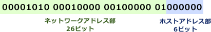
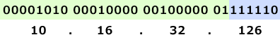

# [平成30年秋期 午前 問34](https://www.ap-siken.com/kakomon/30_aki/q34.html)

#問題 #テクノロジ #ネットワーク #通信プロトコル

解説を表示解説を隠す

<strong>問34</strong>　あるサブネットでは，ルータやスイッチなどのネットワーク機器にIPアドレスを割り当てる際，割当て可能なアドレスの末尾から降順に使用するルールを採用している。このサブネットのネットワークアドレスを 10.16.32.64/26 とするとき，10番目に割り当てられるネットワーク機器のアドレスはどれか。ここで，ネットワーク機器1台に対して，このサブネット内のアドレス1個を割り当てるものとする。

<ul class="ap-choices">
<li class="ap-choice-item ap-wrong">

ア　10.16.32.54

/26のホスト範囲外であり、末尾から降順の10番目でもない

</li>
<li class="ap-choice-item ap-wrong">

イ　10.16.32.55

/26のホスト範囲外であり、末尾から降順の10番目でもない

</li>
<li class="ap-choice-item ap-correct">

ウ　10.16.32.117

正しい。割当て可能末尾126から降順に数えて10番目

</li>
<li class="ap-choice-item ap-wrong">

エ　10.16.32.118

末尾126から降順だと9番目であり、10番目ではない

</li>
</ul>

<h4>解説</h4>

<a href="用語/IPv4" class="internal-link" data-href="用語/IPv4">IPv4</a>アドレス 10.16.32.64/26 の「/26」はプレフィックス長が26であることを示します。つまり、先頭から26ビット目までがネットワークアドレス、残りの6ビットがホストアドレス部です。ビット表現でネットワークアドレス部とホストアドレス部の区別を表すと次のとおりです。

6ビットで表現可能なビット列は 000000～111111 ですが、このうち全ビットが"0"のネットワークアドレスと全ビットが"1"の<a href="用語/ブロードキャスト" class="internal-link" data-href="用語/ブロードキャスト">ブロードキャスト</a>アドレスはホストアドレスとして使うことができません。したがって、割当て可能なホストアドレスの範囲は 000001～111110、その末尾は 111110 になります。

この末尾のアドレスを10進表記で表すと、次のように 10.16.32.126 です。

10.16.32.126 を末尾から1番目のアドレスとすると、そこから 126→125→124→…と降順に数えて10番目のアドレスは 10.16.32.117 となります。したがって正解は「ウ」です。

