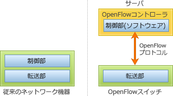

# [平成30年秋期 午前 問35](https://www.ap-siken.com/kakomon/30_aki/q35.html)

#問題 #テクノロジ #ネットワーク #ネットワーク管理

解説を表示解説を隠す

<strong>問35</strong>　OpenFlowを使ったSDN(Software-Defined Networking)の説明として，適切なものはどれか。

<ul class="ap-choices">
<li class="ap-choice-item ap-wrong">

ア　単一の物理サーバ内の仮想サーバ同士が，外部のネットワーク機器を経由せずに，物理サーバ内部のソフトウェアで実現された仮想スイッチを経由して，通信する方式

これはネットワーク<a href="用語/仮想化" class="internal-link" data-href="用語/仮想化">仮想化</a>(VNF:Virtual Network Function)の説明です

</li>
<li class="ap-choice-item ap-correct">

イ　データを転送するネットワーク機器とは分離したソフトウェアによって，ネットワーク機器を集中的に制御，管理するアーキテクチャ

正しい。<a href="用語/SDN" class="internal-link" data-href="用語/SDN">SDN</a>の説明です

</li>
<li class="ap-choice-item ap-wrong">

ウ　プロトコルの文法を形式言語を使って厳密に定義する，ISOで標準化された通信プロトコルの規格

これはASN.1(Abstract Syntax Notation One)の説明です

</li>
<li class="ap-choice-item ap-wrong">

エ　ルータやスイッチの機器内部で動作するソフトウェアを，オープンソースソフトウェア(OSS)で実現する方式

<a href="用語/OpenFlow" class="internal-link" data-href="用語/OpenFlow">OpenFlow</a>による<a href="用語/SDN" class="internal-link" data-href="用語/SDN">SDN</a>は、制御と転送を分離し、ネットワーク機器の転送制御を外部のコントローラー上のソフトウェアによって行う<a href="用語/アーキテクチャ" class="internal-link" data-href="用語/アーキテクチャ">アーキテクチャ</a>です。オープンソースソフトウェアの"open"とは何ら関係がありません

</li>
</ul>

<h4>解説</h4>

<a href="用語/SDN" class="internal-link" data-href="用語/SDN">SDN</a>(Software-Defined Networking)は、ソフトウェア制御によって物理的な<a href="用語/ネットワーク構成" class="internal-link" data-href="用語/ネットワーク構成">ネットワーク構成</a>にとらわれない動的で柔軟なネットワークを実現する技術全般を意味します。

<a href="用語/SDN" class="internal-link" data-href="用語/SDN">SDN</a>を実現するための技術標準が<a href="用語/OpenFlow" class="internal-link" data-href="用語/OpenFlow">OpenFlow</a>プロトコルであり、既存のネットワーク機器がもつ制御処理(コントロールプレーン)と転送処理(データプレーン)を分離することで、<a href="用語/OpenFlow" class="internal-link" data-href="用語/OpenFlow">OpenFlow</a>コントローラーが中央集権的に複数のスイッチの転送制御を管理します。<a href="用語/OpenFlow" class="internal-link" data-href="用語/OpenFlow">OpenFlow</a>では<a href="用語/パケット" class="internal-link" data-href="用語/パケット">パケット</a>や<a href="用語/フレーム" class="internal-link" data-href="用語/フレーム">フレーム</a>をフローとして扱い、フローの様々な情報を使って柔軟に転送制御できるようになっています。スイッチは<a href="用語/OpenFlow" class="internal-link" data-href="用語/OpenFlow">OpenFlow</a>コントローラーと通信を行いながら、<a href="用語/OpenFlow" class="internal-link" data-href="用語/OpenFlow">OpenFlow</a>コントローラーから提供されるフローテーブルや直接の転送指示により転送先を判断します。

