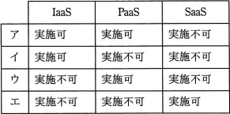
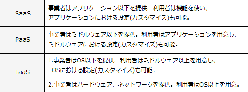
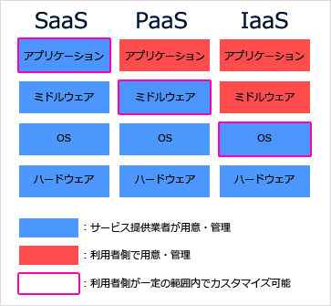

# [平成30年秋期 午前 問38](https://www.ap-siken.com/kakomon/30_aki/q38.html)

#問題 #テクノロジ #セキュリティ #情報セキュリティ対策

解説を表示解説を隠す

<strong>問38</strong>　JIS X 9401:2016(情報技術－クラウドコンピューティング－概要及び用語)の定義によるクラウドサービス区分において，パブリッククラウドのクラウドサービスカスタマのシステム管理者が，仮想サーバのゲストOSに対するセキュリティパッチの管理と適用を実施可か実施不可かの組合せのうち，適切なものはどれか。 

<ul class="ap-choices">
<li class="ap-choice-item ap-wrong">

ア

<a href="用語/SaaS" class="internal-link" data-href="用語/SaaS">SaaS</a>・<a href="用語/PaaS" class="internal-link" data-href="用語/PaaS">PaaS</a>・<a href="用語/IaaS" class="internal-link" data-href="用語/IaaS">IaaS</a>の実施可／不可の組合せが誤っています。組合せは選択肢表を参照してください。

</li>
<li class="ap-choice-item ap-correct">

イ

正しい。OSに対する管理権限を持つのは<a href="用語/IaaS" class="internal-link" data-href="用語/IaaS">IaaS</a>だけで、ゲストOSのセキュリティパッチ管理・適用は<a href="用語/IaaS" class="internal-link" data-href="用語/IaaS">IaaS</a>のみ実施可です。

</li>
<li class="ap-choice-item ap-wrong">

ウ

<a href="用語/SaaS" class="internal-link" data-href="用語/SaaS">SaaS</a>・<a href="用語/PaaS" class="internal-link" data-href="用語/PaaS">PaaS</a>・<a href="用語/IaaS" class="internal-link" data-href="用語/IaaS">IaaS</a>の実施可／不可の組合せが誤っています。組合せは選択肢表を参照してください。

</li>
<li class="ap-choice-item ap-wrong">

エ

<a href="用語/SaaS" class="internal-link" data-href="用語/SaaS">SaaS</a>・<a href="用語/PaaS" class="internal-link" data-href="用語/PaaS">PaaS</a>・<a href="用語/IaaS" class="internal-link" data-href="用語/IaaS">IaaS</a>の実施可／不可の組合せが誤っています。組合せは選択肢表を参照してください。

</li>
</ul>

<h4>解説</h4>

<a href="用語/JIS" class="internal-link" data-href="用語/JIS">JIS</a> X 9401:2016では、<a href="用語/クラウドコンピューティング" class="internal-link" data-href="用語/クラウドコンピューティング">クラウドコンピューティング</a>のサービスモデル「<a href="用語/SaaS" class="internal-link" data-href="用語/SaaS">SaaS</a>」「<a href="用語/PaaS" class="internal-link" data-href="用語/PaaS">PaaS</a>」「<a href="用語/IaaS" class="internal-link" data-href="用語/IaaS">IaaS</a>」について次のように区分しています。

<a href="用語/SaaS" class="internal-link" data-href="用語/SaaS">SaaS</a>（Software as a Service）サービス利用者が、<a href="用語/クラウドサービス" class="internal-link" data-href="用語/クラウドサービス">クラウドサービス</a>提供者のアプリケーションを利用することができる形態

<a href="用語/PaaS" class="internal-link" data-href="用語/PaaS">PaaS</a>（Platform as a Service）サービス利用者が、<a href="用語/クラウドサービス" class="internal-link" data-href="用語/クラウドサービス">クラウドサービス</a>提供者によってサポートされる一つ以上のプログラミング言語と一つ以上の実行環境とを使って利用者が作った又は利用者が入手したアプリケーションを配置し、管理し、及び実行することができる形態

<a href="用語/IaaS" class="internal-link" data-href="用語/IaaS">IaaS</a>（Infrastructure as a Service）サービス利用者が、<a href="用語/クラウドサービス" class="internal-link" data-href="用語/クラウドサービス">クラウドサービス</a>提供者の演算リソース、ストレージリソース又はネットワーキングリソースを供給及び利用することができる形態

3つのサービスモデルの特徴をまとめると以下のようになります。

3つのモデルのうち"OSに対する管理権限"を持つのは<a href="用語/IaaS" class="internal-link" data-href="用語/IaaS">IaaS</a>だけなので、<a href="用語/IaaS" class="internal-link" data-href="用語/IaaS">IaaS</a>だけがゲストOSに対するセキュリティパッチの管理と適用を実施可能です。したがって適切な組合せは「イ」になります。

なお、<a href="用語/パブリッククラウド" class="internal-link" data-href="用語/パブリッククラウド">パブリッククラウド</a>と<a href="用語/クラウドサービス" class="internal-link" data-href="用語/クラウドサービス">クラウドサービス</a>カスタマについては次のように定義されています。

<a href="用語/パブリッククラウド" class="internal-link" data-href="用語/パブリッククラウド">パブリッククラウド</a>　<a href="用語/クラウドサービス" class="internal-link" data-href="用語/クラウドサービス">クラウドサービス</a>が任意の<a href="用語/クラウドサービス" class="internal-link" data-href="用語/クラウドサービス">クラウドサービス</a>カスタマに対して潜在的に利用可能であり，リソースは<a href="用語/クラウドサービス" class="internal-link" data-href="用語/クラウドサービス">クラウドサービス</a>プロバイダによって制御されているクラウド配置モデル →つまり、資源を複数の利用者で共有する形態

<a href="用語/クラウドサービス" class="internal-link" data-href="用語/クラウドサービス">クラウドサービス</a>カスタマ　<a href="用語/クラウドサービス" class="internal-link" data-href="用語/クラウドサービス">クラウドサービス</a>を使うためにビジネス関係にある自然人又は法人 →つまり、サービス利用者のこと

