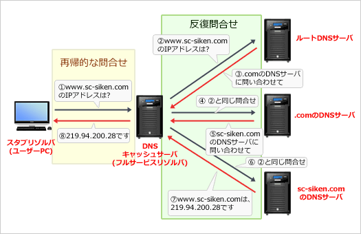

# [平成30年秋期 午前 問39](https://www.ap-siken.com/kakomon/30_aki/q39.html)

#問題 #テクノロジ #セキュリティ #セキュリティ実装技術

解説を表示解説を隠す

<strong>問39</strong>　DNSキャッシュサーバに対して外部から行われるキャッシュポイズニング攻撃への対策のうち，適切なものはどれか。

<ul class="ap-choices">
<li class="ap-choice-item ap-wrong">

ア　外部ネットワークからの再帰的な問合せにも応答できるように，コンテンツサーバにキャッシュサーバを兼ねさせる。

キャッシュサーバは外部からの再帰的な問合せに応じない設定にする必要があります。

</li>
<li class="ap-choice-item ap-correct">

イ　再帰的な問合せに対しては，内部ネットワークからのものだけを許可するように設定する。

正しい。再帰的な問合せを受け付けるホストを内部ネットワークだけに限定することが対策です。

</li>
<li class="ap-choice-item ap-wrong">

ウ　再帰的な問合せを行う際の送信元のポート番号を固定する。

送信元の<a href="用語/ポート番号" class="internal-link" data-href="用語/ポート番号">ポート番号</a>を固定しても、外部からの再帰的な問合せに対して効果はありません。

</li>
<li class="ap-choice-item ap-wrong">

エ　再帰的な問合せを行う際のトランザクションIDを固定する。

トランザクションIDを固定しても、外部からの再帰的な問合せに対して効果はありません。

</li>
</ul>

<h4>解説</h4>

<strong><a href="用語/DNSキャッシュポイズニング" class="internal-link" data-href="用語/DNSキャッシュポイズニング">DNSキャッシュポイズニング</a>攻撃</strong>は、<a href="用語/DNS" class="internal-link" data-href="用語/DNS">DNS</a>キャッシュサーバに偽の<a href="用語/DNS" class="internal-link" data-href="用語/DNS">DNS</a>情報をキャッシュとして登録させることで、利用者を偽のWebサイトに誘導する攻撃です。

まず設問に登場する「再帰的な問合せ」について確認しておきます。<a href="用語/DNS" class="internal-link" data-href="用語/DNS">DNS</a>の名前解決はその性質によって「再帰的な問合せ」と「反復(非再帰的)問合せ」に区別されます。

<dl>
<dt>再帰的な問合せ</dt>
<dd>リゾルバから名前解決要求を受けた<a href="用語/DNS" class="internal-link" data-href="用語/DNS">DNS</a>サーバが他の<a href="用語/DNS" class="internal-link" data-href="用語/DNS">DNS</a>サーバに代理して問合せを行い、最終的な結果をリゾルバに返す必要のある問合せのこと</dd>
<dt>反復問合せ</dt>
<dd>リゾルバから再帰的問合せを受けた<a href="用語/DNS" class="internal-link" data-href="用語/DNS">DNS</a>サーバが、それを解決できるまで繰り返し他の<a href="用語/DNS" class="internal-link" data-href="用語/DNS">DNS</a>サーバに行う問合せのこと</dd>
</dl>

この2つの問合せの違いを踏まえて、攻撃者が<a href="用語/DNS" class="internal-link" data-href="用語/DNS">DNS</a>キャッシュサーバに偽のキャッシュ情報を登録させる手順を追ってみます。

<ol>
<li>攻撃者は、キャッシュサーバに対して偽の再帰的な問合せを行い反復問合せを強制的に生じさせる。</li>
<li>キャッシュサーバは、コンテンツサーバに対して反復問合せを行う。</li>
<li>攻撃者は、コンテンツサーバが正規の応答を返すよりも先にキャッシュサーバへ偽の応答を送りつける。</li>
<li>キャッシュサーバは、攻撃者から送られた偽の応答を正規のものと判断しキャッシュに登録する。この時点で<a href="用語/DNS" class="internal-link" data-href="用語/DNS">DNS</a>クエリは解決済なのでコンテンツサーバから送られた正規の応答は破棄される。</li>
</ol>

<a href="用語/DNSキャッシュポイズニング" class="internal-link" data-href="用語/DNSキャッシュポイズニング">DNSキャッシュポイズニング</a>は、上記のように外部から攻撃目的で送られた再帰的な問合せをキャッシュサーバが処理してしまうことから始まります。再帰的問合せの役割は、内部ネットワークのホストが外部ネットワークに接続する際の名前解決であり、原則として外部からの再帰的な問合せに応じる必要はないはずですから、<em>再帰的な問合せを受け付けるホストを内部ネットワークだけに限定する</em>ことがキャッシュポイズニング攻撃への対策となります。

また、<a href="用語/DNS" class="internal-link" data-href="用語/DNS">DNS</a>では送信元の<a href="用語/IPアドレス" class="internal-link" data-href="用語/IPアドレス">IPアドレス</a>と<a href="用語/ポート番号" class="internal-link" data-href="用語/ポート番号">ポート番号</a>、トランザクションIDの全てが一致しないと、キャッシュサーバはコンテンツサーバからの正しい応答として認めない仕組みを備えています。このため<a href="用語/DNSキャッシュポイズニング" class="internal-link" data-href="用語/DNSキャッシュポイズニング">DNSキャッシュポイズニング</a>が成立するためには、反復問合せに対する偽の応答メッセージに含まれる各情報を正規の応答と一致させる必要があります。<a href="用語/DNS" class="internal-link" data-href="用語/DNS">DNS</a>の設定で、<a href="用語/ポート番号" class="internal-link" data-href="用語/ポート番号">ポート番号</a>やトランザクションIDが固定されていたり推測されやすいものになっていたりすると、<a href="用語/パケット" class="internal-link" data-href="用語/パケット">パケット</a>の偽装が容易になり攻撃に対して脆弱になってしまいます。

