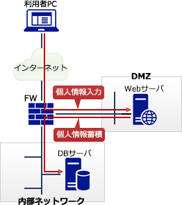

# [平成30年秋期 午前 問40](https://www.ap-siken.com/kakomon/30_aki/q40.html)

#問題 #テクノロジ #セキュリティ #セキュリティ実装技術

解説を表示解説を隠す

<strong>問40</strong>　インターネットに接続された利用者のPCから，DMZ上の公開Webサイトにアクセスし，利用者の個人情報を入力すると，その個人情報が内部ネットワークのデータベース(DB)サーバに蓄積されるシステムがある。このシステムにおいて，利用者個人のデジタル証明書を用いたTLS通信を行うことによって期待できるセキュリティ上の効果はどれか。

<ul class="ap-choices">
<li class="ap-choice-item ap-wrong">

ア　PCとDBサーバ間の通信データを暗号化するとともに，正当なDBサーバであるかを検証することができるようになる。

利用者PCと通信を行うのは<a href="用語/Webサーバ" class="internal-link" data-href="用語/Webサーバ">Webサーバ</a>である。また、利用者個人の<a href="用語/デジタル証明書" class="internal-link" data-href="用語/デジタル証明書">デジタル証明書</a>は利用者の<a href="用語/認証" class="internal-link" data-href="用語/認証">認証</a>に使用する。

</li>
<li class="ap-choice-item ap-wrong">

イ　PCとDBサーバ間の通信データを暗号化するとともに，利用者を認証することができるようになる。

<a href="用語/DMZ" class="internal-link" data-href="用語/DMZ">DMZ</a>を介した通信なので利用者PCとDBサーバは通信しない。利用者PCと通信を行うのは<a href="用語/Webサーバ" class="internal-link" data-href="用語/Webサーバ">Webサーバ</a>である。

</li>
<li class="ap-choice-item ap-wrong">

ウ　PCとWebサーバ間の通信データを暗号化するとともに，正当なDBサーバであるかを検証することができるようになる。

利用者個人の<a href="用語/デジタル証明書" class="internal-link" data-href="用語/デジタル証明書">デジタル証明書</a>は利用者の<a href="用語/認証" class="internal-link" data-href="用語/認証">認証</a>に使用する（サーバ検証には使わない）。

</li>
<li class="ap-choice-item ap-correct">

エ　PCとWebサーバ間の通信データを暗号化するとともに，利用者を認証することができるようになる。

正しい。PCと<a href="用語/Webサーバ" class="internal-link" data-href="用語/Webサーバ">Webサーバ</a>間のTLSで暗号化し、利用者個人の<a href="用語/デジタル証明書" class="internal-link" data-href="用語/デジタル証明書">デジタル証明書</a>でクライアント<a href="用語/認証" class="internal-link" data-href="用語/認証">認証</a>ができる。

</li>
</ul>

<h4>解説</h4>

設問の関係を図示すると次のようになります。

設問の事例は<a href="用語/DMZ" class="internal-link" data-href="用語/DMZ">DMZ</a>を介した通信になっているので、コネクションを確立するのは利用者PCと<a href="用語/Webサーバ" class="internal-link" data-href="用語/Webサーバ">Webサーバ</a>、<a href="用語/Webサーバ" class="internal-link" data-href="用語/Webサーバ">Webサーバ</a>とDBサーバの組みになります。そして、<a href="用語/デジタル証明書" class="internal-link" data-href="用語/デジタル証明書">デジタル証明書</a>は利用者個人のものですので利用者<a href="用語/認証" class="internal-link" data-href="用語/認証">認証</a>のために使用します。

したがって適切な説明は「エ」です。

TLS通信では、必須のサーバ<a href="用語/認証" class="internal-link" data-href="用語/認証">認証</a>とは別にオプションでクライアント<a href="用語/認証" class="internal-link" data-href="用語/認証">認証</a>を行うこともできます。利用者PCと通信を行う<a href="用語/Webサーバ" class="internal-link" data-href="用語/Webサーバ">Webサーバ</a>は、利用者個人の<a href="用語/デジタル証明書" class="internal-link" data-href="用語/デジタル証明書">デジタル証明書</a>に付された認証局の署名を検証することで、<a href="用語/デジタル証明書" class="internal-link" data-href="用語/デジタル証明書">デジタル証明書</a>の正当性を確認します。<a href="用語/デジタル証明書" class="internal-link" data-href="用語/デジタル証明書">デジタル証明書</a>が正当なものならば、利用者(クライアント)の<a href="用語/真正性" class="internal-link" data-href="用語/真正性">真正性</a>が証明されます。

