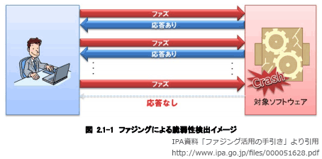

# [平成30年秋期 午前 問43](https://www.ap-siken.com/kakomon/30_aki/q43.html)

#問題 #テクノロジ #セキュリティ #セキュリティ技術評価

解説を表示解説を隠す

<strong>問43</strong>　脆弱性検査手法の一つであるファジングはどれか。

<ul class="ap-choices">
<li class="ap-choice-item ap-wrong">

ア　既知の脆弱性に対するシステムの対応状況に注目し，システムに導入されているソフトウェアのバージョン及びパッチの適用状況の検査を行う。

これはバージョンチェックツールの説明です

</li>
<li class="ap-choice-item ap-correct">

イ　ソフトウェアのデータの入出力に注目し，問題を引き起こしそうなデータを大量に多様なパターンで入力して挙動を観察し，脆弱性を見つける。

正しい。<a href="用語/ファジング" class="internal-link" data-href="用語/ファジング">ファジング</a>の説明です

</li>
<li class="ap-choice-item ap-wrong">

ウ　ベンダーや情報セキュリティ関連機関が提供するセキュリティアドバイザリなどの最新のセキュリティ情報に注目し，ソフトウェアの脆弱性の検査を行う。

<a href="用語/JVN" class="internal-link" data-href="用語/JVN">JVN</a>などが提供する<a href="用語/脆弱性" class="internal-link" data-href="用語/脆弱性">脆弱性</a>対策情報データベースなどを活用した検査です

</li>
<li class="ap-choice-item ap-wrong">

エ　ホワイトボックス検査の一つであり，ソフトウェアの内部構造に注目し，ソースコードの構文をチェックすることによって脆弱性を見つける。

これはソースコードセキュリティ検査ツールの説明です

</li>
</ul>

<h4>解説</h4>

<a href="用語/ファジング" class="internal-link" data-href="用語/ファジング">ファジング</a>(fuzzing)とは、検査対象のソフトウェア製品に「ファズ（英名：fuzz）」と呼ばれる問題を引き起こしそうなデータを大量に送り込み、その応答や挙動を監視することで(未知の)<a href="用語/脆弱性" class="internal-link" data-href="用語/脆弱性">脆弱性</a>を検出する検査手法です。

<a href="用語/ファジング" class="internal-link" data-href="用語/ファジング">ファジング</a>は、ファズデータの生成、検査対象への送信、挙動の監視を自動で行う<a href="用語/ファジング" class="internal-link" data-href="用語/ファジング">ファジング</a>ツール(ファザー)と呼ばれるソフトウェアを使用して行います。開発ライフサイクルに<a href="用語/ファジング" class="internal-link" data-href="用語/ファジング">ファジング</a>を導入することで「バグや<a href="用語/脆弱性" class="internal-link" data-href="用語/脆弱性">脆弱性</a>の低減」「テストの自動化・効率化によるコスト削減」が期待できるため、大手企業の一部で徐々に活用され始めています。

