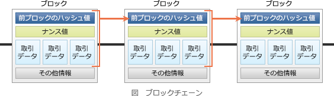

# [平成30年秋期 午前 問44](https://www.ap-siken.com/kakomon/30_aki/q44.html)

#問題 #テクノロジ #セキュリティ #セキュリティ実装技術

解説を表示解説を隠す

<strong>問44</strong>　取引履歴などのデータとハッシュ値の組みを順次つなげて記録した分散型台帳を，ネットワーク上の多数のコンピュータで同期して保有し，管理することによって，一部の台帳で取引データが改ざんされても，取引データの完全性と可用性が確保されることを特徴とする技術はどれか。

<ul class="ap-choices">
<li class="ap-choice-item ap-wrong">

ア　MAC(Message Authentication Code)

詳細：<a href="用語/MAC" class="internal-link" data-href="用語/MAC">MAC</a>(Message Authentication Code)

</li>
<li class="ap-choice-item ap-wrong">

イ　XML署名

詳細：XML署名

</li>
<li class="ap-choice-item ap-wrong">

ウ　ニューラルネットワーク

詳細：<a href="用語/ニューラルネットワーク" class="internal-link" data-href="用語/ニューラルネットワーク">ニューラルネットワーク</a>

</li>
<li class="ap-choice-item ap-correct">

エ　ブロックチェーン

正しい。詳細：<a href="用語/ブロックチェーン" class="internal-link" data-href="用語/ブロックチェーン">ブロックチェーン</a>

</li>
</ul>

<h4>解説</h4>

<a href="用語/ブロックチェーン" class="internal-link" data-href="用語/ブロックチェーン">ブロックチェーン</a>は、仮想通貨(暗号通貨)の基盤技術であり、"ブロック"と呼ばれる幾つかの取引データをまとめた単位を<a href="用語/ハッシュ関数" class="internal-link" data-href="用語/ハッシュ関数">ハッシュ関数</a>で鎖のように繋ぐことによって、台帳を形成し、P2Pネットワークで管理する技術です。分散型台帳技術とも呼ばれます。

日本<a href="用語/ブロックチェーン" class="internal-link" data-href="用語/ブロックチェーン">ブロックチェーン</a>協会では、(広義の)<a href="用語/ブロックチェーン" class="internal-link" data-href="用語/ブロックチェーン">ブロックチェーン</a>を次のように定義しています。

「電子署名とハッシュポインタを使用し改竄検出が容易な<a href="用語/データ構造" class="internal-link" data-href="用語/データ構造">データ構造</a>を持ち、且つ、当該データをネットワーク上に分散する多数のノードに保持させることで、高<a href="用語/可用性" class="internal-link" data-href="用語/可用性">可用性</a>及びデータ同一性等を実現する技術を広義の<a href="用語/ブロックチェーン" class="internal-link" data-href="用語/ブロックチェーン">ブロックチェーン</a>と呼ぶ」

