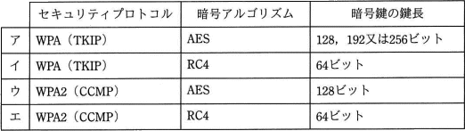
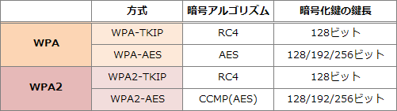

# [平成30年秋期 午前 問45](https://www.ap-siken.com/kakomon/30_aki/q45.html)

#問題 #テクノロジ #セキュリティ #セキュリティ実装技術

解説を表示解説を隠す

<strong>問45</strong>　無線LANのセキュリティプロトコル，暗号アルゴリズム，暗号鍵の鍵長の組合せのうち，適切なものはどれか。 

<ul class="ap-choices">
<li class="ap-choice-item ap-wrong">

ア

WPAでは WPA-TKIP または WPA-<a href="用語/AES" class="internal-link" data-href="用語/AES">AES</a> を選択可能ですが、TKIPのときは必ずRC4を使用することになります。

</li>
<li class="ap-choice-item ap-wrong">

イ

WPAのRC4暗号鍵の鍵長は128ビットです。

</li>
<li class="ap-choice-item ap-correct">

ウ

正しい。<a href="用語/WPA2" class="internal-link" data-href="用語/WPA2">WPA2</a>-<a href="用語/AES" class="internal-link" data-href="用語/AES">AES</a>ではCCMモードの<a href="用語/AES" class="internal-link" data-href="用語/AES">AES</a>(CCMP)に基づいて暗号化を行います。また、<a href="用語/AES" class="internal-link" data-href="用語/AES">AES</a>の鍵長は128ビット、192ビット、256ビットから選択します。

</li>
<li class="ap-choice-item ap-wrong">

エ

<a href="用語/WPA2" class="internal-link" data-href="用語/WPA2">WPA2</a>では <a href="用語/WPA2" class="internal-link" data-href="用語/WPA2">WPA2</a>-TKIP または <a href="用語/WPA2" class="internal-link" data-href="用語/WPA2">WPA2</a>-<a href="用語/AES" class="internal-link" data-href="用語/AES">AES</a>(CCMP) を選択可能ですが、CCMPは<a href="用語/AES" class="internal-link" data-href="用語/AES">AES</a>ベースの暗号化アルゴリズムですのでCCMPのときには必ず<a href="用語/AES" class="internal-link" data-href="用語/AES">AES</a>を使用することになります。

</li>
</ul>

<h4>解説</h4>

WPAと<a href="用語/WPA2" class="internal-link" data-href="用語/WPA2">WPA2</a>の<a href="用語/セキュリティプロトコル" class="internal-link" data-href="用語/セキュリティプロトコル">セキュリティプロトコル</a>、暗号アルゴリズム、暗号鍵の鍵長をまとめると次のようになります。

