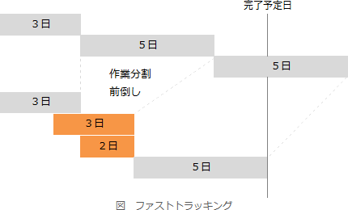

# [平成30年秋期 午前 問51](https://www.ap-siken.com/kakomon/30_aki/q51.html)

#問題 #マネジメント #プロジェクトマネジメント #プロジェクトの時間

解説を表示解説を隠す

<strong>問51</strong>　プロジェクトの期間を短縮する方法のうち，クラッシングに該当するものはどれか。

<ul class="ap-choices">
<li class="ap-choice-item ap-wrong">

ア　作業の前後関係を組み直し，実施する順番を変える。

これは<a href="用語/ファストトラッキング" class="internal-link" data-href="用語/ファストトラッキング">ファストトラッキング</a>の説明です

</li>
<li class="ap-choice-item ap-wrong">

イ　作業を分析し，同時に実施できる部分を複数の作業に分割し，並行して実施する。

これは<a href="用語/ファストトラッキング" class="internal-link" data-href="用語/ファストトラッキング">ファストトラッキング</a>の説明です

</li>
<li class="ap-choice-item ap-wrong">

ウ　先行作業の一部の成果物が完成した時点で，後続作業を開始する。

これは<a href="用語/ファストトラッキング" class="internal-link" data-href="用語/ファストトラッキング">ファストトラッキング</a>の説明です

</li>
<li class="ap-choice-item ap-correct">

エ　プロジェクトの外部から要員を調達し，クリティカルパス上の作業に投入する。

正しい。詳細：<a href="用語/クラッシング" class="internal-link" data-href="用語/クラッシング">クラッシング</a>

</li>
</ul>

<h4>解説</h4>

プロジェクト期間を短縮する方法は、<a href="用語/クラッシング" class="internal-link" data-href="用語/クラッシング">クラッシング</a>と<a href="用語/ファストトラッキング" class="internal-link" data-href="用語/ファストトラッキング">ファストトラッキング</a>に大別されます。

<a href="用語/クラッシング" class="internal-link" data-href="用語/クラッシング">クラッシング</a>は、アクティビティに追加資源を投入し、所要期間を短縮することでスケジュールの短縮を図る方法です。

<a href="用語/ファストトラッキング" class="internal-link" data-href="用語/ファストトラッキング">ファストトラッキング</a>は、開始当初の計画では直列に並んでいた作業を同時並行的に行ったり、作業の前後を入れ替えたりすることで期間短縮を図る方法です。

したがって「エ」が適切です。

