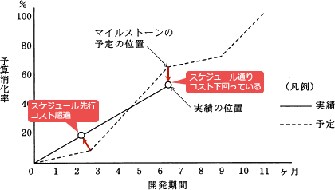

# [平成30年秋期 午前 問52](https://www.ap-siken.com/kakomon/30_aki/q52.html)

#問題 #マネジメント #プロジェクトマネジメント #プロジェクトの時間

解説を表示解説を隠す

<strong>問52</strong>　システム開発の進捗管理などに用いられるトレンドチャートの説明はどれか。

<ul class="ap-choices">
<li class="ap-choice-item ap-wrong">

ア　作業に関与する人と責任をマトリックスで示したもの

これは責任分担表の説明です

</li>
<li class="ap-choice-item ap-wrong">

イ　作業日程の計画と実績を対比できるように帯状に示したもの

これは<a href="用語/ガントチャート" class="internal-link" data-href="用語/ガントチャート">ガントチャート</a>の説明です

</li>
<li class="ap-choice-item ap-correct">

ウ　作業の進捗状況と予算の消費状況を関連付けて折れ線で示したもの

正しい。詳細：トレンドチャート

</li>
<li class="ap-choice-item ap-wrong">

エ　作業の順序や相互関係をネットワーク図で示したもの

これは<a href="用語/アローダイアグラム" class="internal-link" data-href="用語/アローダイアグラム">アローダイアグラム</a>やプレシデンスダイアグラムの説明です

</li>
</ul>

<h4>解説</h4>

トレンドチャートは、計画の予算・工期、および実績の費用・進捗を表す2本の折れ線グラフを並べたグラフで、差異の把握や傾向(トレンド)の分析に用いられます。

したがって「ウ」が適切です。

