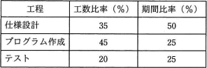

# [平成30年秋期 午前 問53](https://www.ap-siken.com/kakomon/30_aki/q53.html)

#問題 #マネジメント #プロジェクトマネジメント #プロジェクトの資源

解説を表示解説を隠す

<strong>問53</strong>　あるシステムの開発工数を見積もると120人月であった。このシステムの開発を12か月で終えるように表に示す計画を立てる。プログラム作成工程には，何名の要員を確保しておく必要があるか。ここで，工程内での要員の増減はないものとする。 

<ul class="ap-choices">
<li class="ap-choice-item ap-wrong">

ア　7

工数比や期間比の掛け違いで得られる値

</li>
<li class="ap-choice-item ap-wrong">

イ　8

工数比や期間比の掛け違いで得られる値

</li>
<li class="ap-choice-item ap-wrong">

ウ　10

工数比や期間比の掛け違いで得られる値

</li>
<li class="ap-choice-item ap-correct">

エ　18

正しい。プログラム作成工程の工数54人月を期間3か月で割ると18人

</li>
</ul>

<h4>解説</h4>

全体の工数が120人月ですので、プログラム作成工程の工数は以下のように計算できます。

120人月×0.45＝54人月

また、開発期間全体が12カ月ですので、プログラム作成工程の所定期間は、

12か月×0.25＝3か月

54人月の作業を3カ月で完了させなくてならないため、必要な<a href="用語/要員" class="internal-link" data-href="用語/要員">要員</a>数は、

54人月÷3カ月＝18人

したがって「エ」が正解です。

