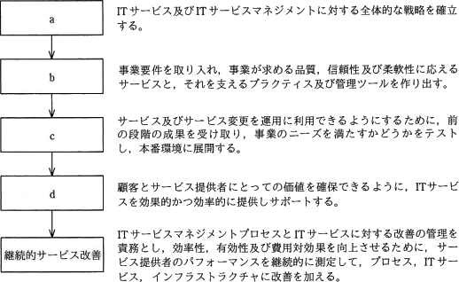
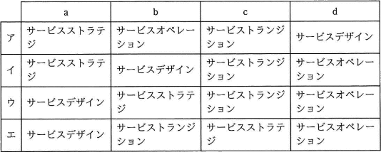

# [平成30年秋期 午前 問55](https://www.ap-siken.com/kakomon/30_aki/q55.html)

#問題 #マネジメント #サービスマネジメント #サービスマネジメントプロセス

解説を表示解説を隠す

<strong>問55</strong>　図は，ITIL 2011 editionのサービスライフサイクルの各段階の説明と流れである。a～dの段階名の適切な組合せはどれか。  

<ul class="ap-choices">
<li class="ap-choice-item ap-wrong">

ア

bがサービスオペレーション、dがサービスデザインとなっており、設計→移行→運用の流れと一致しません。

</li>
<li class="ap-choice-item ap-correct">

イ

正しい。a＝サービスストラテジ、b＝サービスデザイン、c＝サービストランジション、d＝サービスオペレーションに対応します。

</li>
<li class="ap-choice-item ap-wrong">

ウ

aとbが入れ替わっており、戦略のあとに設計が続く流れと一致しません。

</li>
<li class="ap-choice-item ap-wrong">

エ

a〜cの順がサービスデザイン→サービストランジション→サービスストラテジとなっており、説明と一致しません。

</li>
</ul>

<h4>解説</h4>

<a href="用語/ITIL" class="internal-link" data-href="用語/ITIL">ITIL</a> 2011 editionの<a href="用語/サービスライフサイクル" class="internal-link" data-href="用語/サービスライフサイクル">サービスライフサイクル</a>は5つのプロセス群から構成されます。

<ul>
<li>サービスストラテジ（サービス戦略）…サービスをどのように設計、開発、実装、維持していくかという戦略を確立する。</li>
<li>サービスデザイン（サービス設計）…サービス戦略に基づき、顧客およびビジネス上の要件を満たすための具体的なサービスを設計する。</li>
<li>サービストランジション（サービス移行）…新規サービス又はサービスの変更をテストし、本番環境にリリースする。</li>
<li>サービスオペレーション（サービス運用）…<a href="用語/SLA" class="internal-link" data-href="用語/SLA">SLA</a>で合意したサービスレベルを維持し、環境の変化に対応しながらサービスを継続的に提供する。</li>
<li>継続的サービス改善…サービスおよび<a href="用語/サービスマネジメント" class="internal-link" data-href="用語/サービスマネジメント">サービスマネジメント</a>プロセスの機能を継続的に改善する。</li>
</ul>

各説明とプロセスの役割を突き合わせると適切な組合せは「イ」とわかります。

